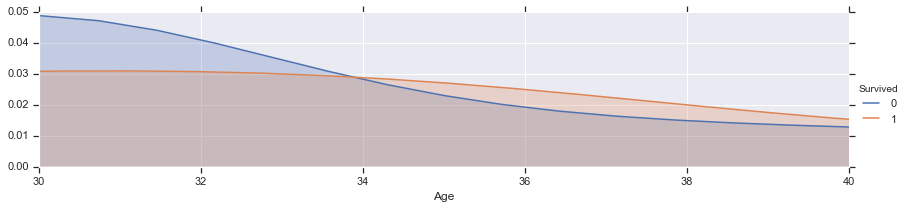

AdmissionDrug


```python
import pandas as pd
```


```python
import numpy
```


```python
import matplotlib.pyplot as plt
```


```python
df=pd.read_csv('admissionDrug.csv')
```


```python
df.head(10)
```


<div>
<style scoped>
    .dataframe tbody tr th:only-of-type {
        vertical-align: middle;
    }

    .dataframe tbody tr th {
        vertical-align: top;
    }

    .dataframe thead th {
        text-align: right;
    }
</style>
<table border="1" class="dataframe">
  <thead>
    <tr style="text-align: right;">
      <th></th>
      <th>admissiondrugid</th>
      <th>patientunitstayid</th>
      <th>drugoffset</th>
      <th>drugenteredoffset</th>
      <th>drugnotetype</th>
      <th>specialtytype</th>
      <th>usertype</th>
      <th>rxincluded</th>
      <th>writtenineicu</th>
      <th>drugname</th>
      <th>drugdosage</th>
      <th>drugunit</th>
      <th>drugadmitfrequency</th>
      <th>drughiclseqno</th>
    </tr>
  </thead>
  <tbody>
    <tr>
      <th>0</th>
      <td>1589228</td>
      <td>242954</td>
      <td>64</td>
      <td>79</td>
      <td>Admission</td>
      <td>eCM Primary</td>
      <td>THC Nurse</td>
      <td>True</td>
      <td>True</td>
      <td>ELIQUIS                                       ...</td>
      <td>0.0</td>
      <td></td>
      <td></td>
      <td>37792</td>
    </tr>
    <tr>
      <th>1</th>
      <td>2063596</td>
      <td>243285</td>
      <td>29</td>
      <td>39</td>
      <td>Admission</td>
      <td>eCM Primary</td>
      <td>THC Nurse</td>
      <td>False</td>
      <td>True</td>
      <td>VICTOZA 2-PAK                                 ...</td>
      <td>0.0</td>
      <td></td>
      <td></td>
      <td>36436</td>
    </tr>
    <tr>
      <th>2</th>
      <td>2063595</td>
      <td>243285</td>
      <td>29</td>
      <td>39</td>
      <td>Admission</td>
      <td>eCM Primary</td>
      <td>THC Nurse</td>
      <td>False</td>
      <td>True</td>
      <td>POTASSIUM CHLORIDE                            ...</td>
      <td>0.0</td>
      <td></td>
      <td></td>
      <td>549</td>
    </tr>
    <tr>
      <th>3</th>
      <td>2063590</td>
      <td>243285</td>
      <td>29</td>
      <td>39</td>
      <td>Admission</td>
      <td>eCM Primary</td>
      <td>THC Nurse</td>
      <td>False</td>
      <td>True</td>
      <td>CITALOPRAM HBR                                ...</td>
      <td>0.0</td>
      <td></td>
      <td></td>
      <td>10321</td>
    </tr>
    <tr>
      <th>4</th>
      <td>2063594</td>
      <td>243285</td>
      <td>29</td>
      <td>39</td>
      <td>Admission</td>
      <td>eCM Primary</td>
      <td>THC Nurse</td>
      <td>False</td>
      <td>True</td>
      <td>OMEPRAZOLE                                    ...</td>
      <td>0.0</td>
      <td></td>
      <td></td>
      <td>4673</td>
    </tr>
    <tr>
      <th>5</th>
      <td>2063593</td>
      <td>243285</td>
      <td>29</td>
      <td>39</td>
      <td>Admission</td>
      <td>eCM Primary</td>
      <td>THC Nurse</td>
      <td>False</td>
      <td>True</td>
      <td>NAPROXEN                                      ...</td>
      <td>0.0</td>
      <td></td>
      <td></td>
      <td>3727</td>
    </tr>
    <tr>
      <th>6</th>
      <td>2063592</td>
      <td>243285</td>
      <td>29</td>
      <td>39</td>
      <td>Admission</td>
      <td>eCM Primary</td>
      <td>THC Nurse</td>
      <td>False</td>
      <td>True</td>
      <td>METFORMIN HCL                                 ...</td>
      <td>0.0</td>
      <td></td>
      <td></td>
      <td>4763</td>
    </tr>
    <tr>
      <th>7</th>
      <td>2063589</td>
      <td>243285</td>
      <td>29</td>
      <td>39</td>
      <td>Admission</td>
      <td>eCM Primary</td>
      <td>THC Nurse</td>
      <td>False</td>
      <td>True</td>
      <td>LIPITOR                                       ...</td>
      <td>0.0</td>
      <td></td>
      <td></td>
      <td>12404</td>
    </tr>
    <tr>
      <th>8</th>
      <td>2063591</td>
      <td>243285</td>
      <td>29</td>
      <td>39</td>
      <td>Admission</td>
      <td>eCM Primary</td>
      <td>THC Nurse</td>
      <td>False</td>
      <td>True</td>
      <td>FLECAINIDE ACETATE                            ...</td>
      <td>0.0</td>
      <td></td>
      <td></td>
      <td>82</td>
    </tr>
    <tr>
      <th>9</th>
      <td>2063588</td>
      <td>243285</td>
      <td>29</td>
      <td>39</td>
      <td>Admission</td>
      <td>eCM Primary</td>
      <td>THC Nurse</td>
      <td>False</td>
      <td>True</td>
      <td>ASPIRIN                                       ...</td>
      <td>0.0</td>
      <td></td>
      <td></td>
      <td>1820</td>
    </tr>
  </tbody>
</table>
</div>


```python
type(df)
```


    pandas.core.frame.DataFrame


```python
print(df.shape)
```

    (874920, 14)
    


```python
test=pd.read_csv('admissionDrug.csv')
```


```python
test.head()
```


<div>
<style scoped>
    .dataframe tbody tr th:only-of-type {
        vertical-align: middle;
    }

    .dataframe tbody tr th {
        vertical-align: top;
    }

    .dataframe thead th {
        text-align: right;
    }
</style>
<table border="1" class="dataframe">
  <thead>
    <tr style="text-align: right;">
      <th></th>
      <th>admissiondrugid</th>
      <th>patientunitstayid</th>
      <th>drugoffset</th>
      <th>drugenteredoffset</th>
      <th>drugnotetype</th>
      <th>specialtytype</th>
      <th>usertype</th>
      <th>rxincluded</th>
      <th>writtenineicu</th>
      <th>drugname</th>
      <th>drugdosage</th>
      <th>drugunit</th>
      <th>drugadmitfrequency</th>
      <th>drughiclseqno</th>
    </tr>
  </thead>
  <tbody>
    <tr>
      <th>0</th>
      <td>1589228</td>
      <td>242954</td>
      <td>64</td>
      <td>79</td>
      <td>Admission</td>
      <td>eCM Primary</td>
      <td>THC Nurse</td>
      <td>True</td>
      <td>True</td>
      <td>ELIQUIS                                       ...</td>
      <td>0.0</td>
      <td></td>
      <td></td>
      <td>37792</td>
    </tr>
    <tr>
      <th>1</th>
      <td>2063596</td>
      <td>243285</td>
      <td>29</td>
      <td>39</td>
      <td>Admission</td>
      <td>eCM Primary</td>
      <td>THC Nurse</td>
      <td>False</td>
      <td>True</td>
      <td>VICTOZA 2-PAK                                 ...</td>
      <td>0.0</td>
      <td></td>
      <td></td>
      <td>36436</td>
    </tr>
    <tr>
      <th>2</th>
      <td>2063595</td>
      <td>243285</td>
      <td>29</td>
      <td>39</td>
      <td>Admission</td>
      <td>eCM Primary</td>
      <td>THC Nurse</td>
      <td>False</td>
      <td>True</td>
      <td>POTASSIUM CHLORIDE                            ...</td>
      <td>0.0</td>
      <td></td>
      <td></td>
      <td>549</td>
    </tr>
    <tr>
      <th>3</th>
      <td>2063590</td>
      <td>243285</td>
      <td>29</td>
      <td>39</td>
      <td>Admission</td>
      <td>eCM Primary</td>
      <td>THC Nurse</td>
      <td>False</td>
      <td>True</td>
      <td>CITALOPRAM HBR                                ...</td>
      <td>0.0</td>
      <td></td>
      <td></td>
      <td>10321</td>
    </tr>
    <tr>
      <th>4</th>
      <td>2063594</td>
      <td>243285</td>
      <td>29</td>
      <td>39</td>
      <td>Admission</td>
      <td>eCM Primary</td>
      <td>THC Nurse</td>
      <td>False</td>
      <td>True</td>
      <td>OMEPRAZOLE                                    ...</td>
      <td>0.0</td>
      <td></td>
      <td></td>
      <td>4673</td>
    </tr>
  </tbody>
</table>
</div>


```python
df.shape
```


    (874920, 14)


```python
test.shape
```


    (874920, 14)


```python
df.info()
```

    <class 'pandas.core.frame.DataFrame'>
    RangeIndex: 874920 entries, 0 to 874919
    Data columns (total 14 columns):
    admissiondrugid       874920 non-null int64
    patientunitstayid     874920 non-null int64
    drugoffset            874920 non-null int64
    drugenteredoffset     874920 non-null int64
    drugnotetype          874920 non-null object
    specialtytype         874920 non-null object
    usertype              874920 non-null object
    rxincluded            874920 non-null bool
    writtenineicu         874920 non-null bool
    drugname              874920 non-null object
    drugdosage            874920 non-null float64
    drugunit              874920 non-null object
    drugadmitfrequency    874920 non-null object
    drughiclseqno         874920 non-null int64
    dtypes: bool(2), float64(1), int64(5), object(6)
    memory usage: 81.8+ MB
    


```python
test.info()
```

    <class 'pandas.core.frame.DataFrame'>
    RangeIndex: 874920 entries, 0 to 874919
    Data columns (total 14 columns):
    admissiondrugid       874920 non-null int64
    patientunitstayid     874920 non-null int64
    drugoffset            874920 non-null int64
    drugenteredoffset     874920 non-null int64
    drugnotetype          874920 non-null object
    specialtytype         874920 non-null object
    usertype              874920 non-null object
    rxincluded            874920 non-null bool
    writtenineicu         874920 non-null bool
    drugname              874920 non-null object
    drugdosage            874920 non-null float64
    drugunit              874920 non-null object
    drugadmitfrequency    874920 non-null object
    drughiclseqno         874920 non-null int64
    dtypes: bool(2), float64(1), int64(5), object(6)
    memory usage: 81.8+ MB
    


```python
df.isnull().sum()
```


    admissiondrugid       0
    patientunitstayid     0
    drugoffset            0
    drugenteredoffset     0
    drugnotetype          0
    specialtytype         0
    usertype              0
    rxincluded            0
    writtenineicu         0
    drugname              0
    drugdosage            0
    drugunit              0
    drugadmitfrequency    0
    drughiclseqno         0
    dtype: int64


```python
test.isnull().sum()
```


    admissiondrugid       0
    patientunitstayid     0
    drugoffset            0
    drugenteredoffset     0
    drugnotetype          0
    specialtytype         0
    usertype              0
    rxincluded            0
    writtenineicu         0
    drugname              0
    drugdosage            0
    drugunit              0
    drugadmitfrequency    0
    drughiclseqno         0
    dtype: int64


```python
import matplotlib.pyplot as plt
```


```python
import seaborn as sns
```


```python
sns.set()
```


```python
%matplotlib inline
```


```python
def bar_chart(feature):
    survived = df[df['Survived']==1][feature].value_counts()
    dead = df[df['Survived']==0][feature].value_counts()
    print survived 
    print dead
    dfd = pd.DataFrame([survived,dead])
    dfd.index = ['Survived','Dead']
    dfd.plot(kind='bar',stacked=True, figsize=(10,5))
```


      File "<ipython-input-26-25ff591022e1>", line 4
        print survived
                     ^
    SyntaxError: Missing parentheses in call to 'print'. Did you mean print(survived)?
    


```python
bar_chart('Sex')
```

    female    233
    male      109
    Name: Sex, dtype: int64
    male      468
    female     81
    Name: Sex, dtype: int64
    


```python
bar_chart('Pclass')
```

    1    136
    3    119
    2     87
    Name: Pclass, dtype: int64
    3    372
    2     97
    1     80
    Name: Pclass, dtype: int64
    


```python
bar_chart('SibSp')
```

    0    210
    1    112
    2     13
    3      4
    4      3
    Name: SibSp, dtype: int64
    0    398
    1     97
    4     15
    2     15
    3     12
    8      7
    5      5
    Name: SibSp, dtype: int64
    


```python
bar_chart('Parch')
```

    0    233
    1     65
    2     40
    3      3
    5      1
    Name: Parch, dtype: int64
    0    445
    1     53
    2     40
    5      4
    4      4
    3      2
    6      1
    Name: Parch, dtype: int64
    


```python
bar_chart('Embarked')
```

    S    217
    C     93
    Q     30
    Name: Embarked, dtype: int64
    S    427
    C     75
    Q     47
    Name: Embarked, dtype: int64
    


```python
sns.barplot(x='Pclass', y='Survived', data=df)
```


    <matplotlib.axes._subplots.AxesSubplot at 0x24a7a1d0>


```python
sns.barplot(x='Sex', y='Survived', data=df)
```


    <matplotlib.axes._subplots.AxesSubplot at 0x2610b6a0>


```python
df.head(10)
```


<div>
<table border="1" class="dataframe">
  <thead>
    <tr style="text-align: right;">
      <th></th>
      <th>PassengerId</th>
      <th>Survived</th>
      <th>Pclass</th>
      <th>Name</th>
      <th>Sex</th>
      <th>Age</th>
      <th>SibSp</th>
      <th>Parch</th>
      <th>Ticket</th>
      <th>Fare</th>
      <th>Cabin</th>
      <th>Embarked</th>
    </tr>
  </thead>
  <tbody>
    <tr>
      <th>0</th>
      <td>1</td>
      <td>0</td>
      <td>3</td>
      <td>Braund, Mr. Owen Harris</td>
      <td>male</td>
      <td>22.0</td>
      <td>1</td>
      <td>0</td>
      <td>A/5 21171</td>
      <td>7.2500</td>
      <td>NaN</td>
      <td>S</td>
    </tr>
    <tr>
      <th>1</th>
      <td>2</td>
      <td>1</td>
      <td>1</td>
      <td>Cumings, Mrs. John Bradley (Florence Briggs Th...</td>
      <td>female</td>
      <td>38.0</td>
      <td>1</td>
      <td>0</td>
      <td>PC 17599</td>
      <td>71.2833</td>
      <td>C85</td>
      <td>C</td>
    </tr>
    <tr>
      <th>2</th>
      <td>3</td>
      <td>1</td>
      <td>3</td>
      <td>Heikkinen, Miss. Laina</td>
      <td>female</td>
      <td>26.0</td>
      <td>0</td>
      <td>0</td>
      <td>STON/O2. 3101282</td>
      <td>7.9250</td>
      <td>NaN</td>
      <td>S</td>
    </tr>
    <tr>
      <th>3</th>
      <td>4</td>
      <td>1</td>
      <td>1</td>
      <td>Futrelle, Mrs. Jacques Heath (Lily May Peel)</td>
      <td>female</td>
      <td>35.0</td>
      <td>1</td>
      <td>0</td>
      <td>113803</td>
      <td>53.1000</td>
      <td>C123</td>
      <td>S</td>
    </tr>
    <tr>
      <th>4</th>
      <td>5</td>
      <td>0</td>
      <td>3</td>
      <td>Allen, Mr. William Henry</td>
      <td>male</td>
      <td>35.0</td>
      <td>0</td>
      <td>0</td>
      <td>373450</td>
      <td>8.0500</td>
      <td>NaN</td>
      <td>S</td>
    </tr>
    <tr>
      <th>5</th>
      <td>6</td>
      <td>0</td>
      <td>3</td>
      <td>Moran, Mr. James</td>
      <td>male</td>
      <td>NaN</td>
      <td>0</td>
      <td>0</td>
      <td>330877</td>
      <td>8.4583</td>
      <td>NaN</td>
      <td>Q</td>
    </tr>
    <tr>
      <th>6</th>
      <td>7</td>
      <td>0</td>
      <td>1</td>
      <td>McCarthy, Mr. Timothy J</td>
      <td>male</td>
      <td>54.0</td>
      <td>0</td>
      <td>0</td>
      <td>17463</td>
      <td>51.8625</td>
      <td>E46</td>
      <td>S</td>
    </tr>
    <tr>
      <th>7</th>
      <td>8</td>
      <td>0</td>
      <td>3</td>
      <td>Palsson, Master. Gosta Leonard</td>
      <td>male</td>
      <td>2.0</td>
      <td>3</td>
      <td>1</td>
      <td>349909</td>
      <td>21.0750</td>
      <td>NaN</td>
      <td>S</td>
    </tr>
    <tr>
      <th>8</th>
      <td>9</td>
      <td>1</td>
      <td>3</td>
      <td>Johnson, Mrs. Oscar W (Elisabeth Vilhelmina Berg)</td>
      <td>female</td>
      <td>27.0</td>
      <td>0</td>
      <td>2</td>
      <td>347742</td>
      <td>11.1333</td>
      <td>NaN</td>
      <td>S</td>
    </tr>
    <tr>
      <th>9</th>
      <td>10</td>
      <td>1</td>
      <td>2</td>
      <td>Nasser, Mrs. Nicholas (Adele Achem)</td>
      <td>female</td>
      <td>14.0</td>
      <td>1</td>
      <td>0</td>
      <td>237736</td>
      <td>30.0708</td>
      <td>NaN</td>
      <td>C</td>
    </tr>
  </tbody>
</table>
</div>


# Title map


```python
train_test_dataset=[df,test]
type(train_test_dataset)
i=0
for k in  train_test_dataset:
    i=i+1
print i


```

    2
    


```python
for dataset in train_test_dataset:
    print dataset
    dataset['Title']=dataset['Name'].str.extract('([A-Za-z]+)\.',expand=False)
```

         PassengerId  Survived  Pclass  \
    0              1         0       3   
    1              2         1       1   
    2              3         1       3   
    3              4         1       1   
    4              5         0       3   
    5              6         0       3   
    6              7         0       1   
    7              8         0       3   
    8              9         1       3   
    9             10         1       2   
    10            11         1       3   
    11            12         1       1   
    12            13         0       3   
    13            14         0       3   
    14            15         0       3   
    15            16         1       2   
    16            17         0       3   
    17            18         1       2   
    18            19         0       3   
    19            20         1       3   
    20            21         0       2   
    21            22         1       2   
    22            23         1       3   
    23            24         1       1   
    24            25         0       3   
    25            26         1       3   
    26            27         0       3   
    27            28         0       1   
    28            29         1       3   
    29            30         0       3   
    ..           ...       ...     ...   
    861          862         0       2   
    862          863         1       1   
    863          864         0       3   
    864          865         0       2   
    865          866         1       2   
    866          867         1       2   
    867          868         0       1   
    868          869         0       3   
    869          870         1       3   
    870          871         0       3   
    871          872         1       1   
    872          873         0       1   
    873          874         0       3   
    874          875         1       2   
    875          876         1       3   
    876          877         0       3   
    877          878         0       3   
    878          879         0       3   
    879          880         1       1   
    880          881         1       2   
    881          882         0       3   
    882          883         0       3   
    883          884         0       2   
    884          885         0       3   
    885          886         0       3   
    886          887         0       2   
    887          888         1       1   
    888          889         0       3   
    889          890         1       1   
    890          891         0       3   
    
                                                      Name     Sex   Age  SibSp  \
    0                              Braund, Mr. Owen Harris    male  22.0      1   
    1    Cumings, Mrs. John Bradley (Florence Briggs Th...  female  38.0      1   
    2                               Heikkinen, Miss. Laina  female  26.0      0   
    3         Futrelle, Mrs. Jacques Heath (Lily May Peel)  female  35.0      1   
    4                             Allen, Mr. William Henry    male  35.0      0   
    5                                     Moran, Mr. James    male   NaN      0   
    6                              McCarthy, Mr. Timothy J    male  54.0      0   
    7                       Palsson, Master. Gosta Leonard    male   2.0      3   
    8    Johnson, Mrs. Oscar W (Elisabeth Vilhelmina Berg)  female  27.0      0   
    9                  Nasser, Mrs. Nicholas (Adele Achem)  female  14.0      1   
    10                     Sandstrom, Miss. Marguerite Rut  female   4.0      1   
    11                            Bonnell, Miss. Elizabeth  female  58.0      0   
    12                      Saundercock, Mr. William Henry    male  20.0      0   
    13                         Andersson, Mr. Anders Johan    male  39.0      1   
    14                Vestrom, Miss. Hulda Amanda Adolfina  female  14.0      0   
    15                    Hewlett, Mrs. (Mary D Kingcome)   female  55.0      0   
    16                                Rice, Master. Eugene    male   2.0      4   
    17                        Williams, Mr. Charles Eugene    male   NaN      0   
    18   Vander Planke, Mrs. Julius (Emelia Maria Vande...  female  31.0      1   
    19                             Masselmani, Mrs. Fatima  female   NaN      0   
    20                                Fynney, Mr. Joseph J    male  35.0      0   
    21                               Beesley, Mr. Lawrence    male  34.0      0   
    22                         McGowan, Miss. Anna "Annie"  female  15.0      0   
    23                        Sloper, Mr. William Thompson    male  28.0      0   
    24                       Palsson, Miss. Torborg Danira  female   8.0      3   
    25   Asplund, Mrs. Carl Oscar (Selma Augusta Emilia...  female  38.0      1   
    26                             Emir, Mr. Farred Chehab    male   NaN      0   
    27                      Fortune, Mr. Charles Alexander    male  19.0      3   
    28                       O'Dwyer, Miss. Ellen "Nellie"  female   NaN      0   
    29                                 Todoroff, Mr. Lalio    male   NaN      0   
    ..                                                 ...     ...   ...    ...   
    861                        Giles, Mr. Frederick Edward    male  21.0      1   
    862  Swift, Mrs. Frederick Joel (Margaret Welles Ba...  female  48.0      0   
    863                  Sage, Miss. Dorothy Edith "Dolly"  female   NaN      8   
    864                             Gill, Mr. John William    male  24.0      0   
    865                           Bystrom, Mrs. (Karolina)  female  42.0      0   
    866                       Duran y More, Miss. Asuncion  female  27.0      1   
    867               Roebling, Mr. Washington Augustus II    male  31.0      0   
    868                        van Melkebeke, Mr. Philemon    male   NaN      0   
    869                    Johnson, Master. Harold Theodor    male   4.0      1   
    870                                  Balkic, Mr. Cerin    male  26.0      0   
    871   Beckwith, Mrs. Richard Leonard (Sallie Monypeny)  female  47.0      1   
    872                           Carlsson, Mr. Frans Olof    male  33.0      0   
    873                        Vander Cruyssen, Mr. Victor    male  47.0      0   
    874              Abelson, Mrs. Samuel (Hannah Wizosky)  female  28.0      1   
    875                   Najib, Miss. Adele Kiamie "Jane"  female  15.0      0   
    876                      Gustafsson, Mr. Alfred Ossian    male  20.0      0   
    877                               Petroff, Mr. Nedelio    male  19.0      0   
    878                                 Laleff, Mr. Kristo    male   NaN      0   
    879      Potter, Mrs. Thomas Jr (Lily Alexenia Wilson)  female  56.0      0   
    880       Shelley, Mrs. William (Imanita Parrish Hall)  female  25.0      0   
    881                                 Markun, Mr. Johann    male  33.0      0   
    882                       Dahlberg, Miss. Gerda Ulrika  female  22.0      0   
    883                      Banfield, Mr. Frederick James    male  28.0      0   
    884                             Sutehall, Mr. Henry Jr    male  25.0      0   
    885               Rice, Mrs. William (Margaret Norton)  female  39.0      0   
    886                              Montvila, Rev. Juozas    male  27.0      0   
    887                       Graham, Miss. Margaret Edith  female  19.0      0   
    888           Johnston, Miss. Catherine Helen "Carrie"  female   NaN      1   
    889                              Behr, Mr. Karl Howell    male  26.0      0   
    890                                Dooley, Mr. Patrick    male  32.0      0   
    
         Parch            Ticket      Fare        Cabin Embarked  
    0        0         A/5 21171    7.2500          NaN        S  
    1        0          PC 17599   71.2833          C85        C  
    2        0  STON/O2. 3101282    7.9250          NaN        S  
    3        0            113803   53.1000         C123        S  
    4        0            373450    8.0500          NaN        S  
    5        0            330877    8.4583          NaN        Q  
    6        0             17463   51.8625          E46        S  
    7        1            349909   21.0750          NaN        S  
    8        2            347742   11.1333          NaN        S  
    9        0            237736   30.0708          NaN        C  
    10       1           PP 9549   16.7000           G6        S  
    11       0            113783   26.5500         C103        S  
    12       0         A/5. 2151    8.0500          NaN        S  
    13       5            347082   31.2750          NaN        S  
    14       0            350406    7.8542          NaN        S  
    15       0            248706   16.0000          NaN        S  
    16       1            382652   29.1250          NaN        Q  
    17       0            244373   13.0000          NaN        S  
    18       0            345763   18.0000          NaN        S  
    19       0              2649    7.2250          NaN        C  
    20       0            239865   26.0000          NaN        S  
    21       0            248698   13.0000          D56        S  
    22       0            330923    8.0292          NaN        Q  
    23       0            113788   35.5000           A6        S  
    24       1            349909   21.0750          NaN        S  
    25       5            347077   31.3875          NaN        S  
    26       0              2631    7.2250          NaN        C  
    27       2             19950  263.0000  C23 C25 C27        S  
    28       0            330959    7.8792          NaN        Q  
    29       0            349216    7.8958          NaN        S  
    ..     ...               ...       ...          ...      ...  
    861      0             28134   11.5000          NaN        S  
    862      0             17466   25.9292          D17        S  
    863      2          CA. 2343   69.5500          NaN        S  
    864      0            233866   13.0000          NaN        S  
    865      0            236852   13.0000          NaN        S  
    866      0     SC/PARIS 2149   13.8583          NaN        C  
    867      0          PC 17590   50.4958          A24        S  
    868      0            345777    9.5000          NaN        S  
    869      1            347742   11.1333          NaN        S  
    870      0            349248    7.8958          NaN        S  
    871      1             11751   52.5542          D35        S  
    872      0               695    5.0000  B51 B53 B55        S  
    873      0            345765    9.0000          NaN        S  
    874      0         P/PP 3381   24.0000          NaN        C  
    875      0              2667    7.2250          NaN        C  
    876      0              7534    9.8458          NaN        S  
    877      0            349212    7.8958          NaN        S  
    878      0            349217    7.8958          NaN        S  
    879      1             11767   83.1583          C50        C  
    880      1            230433   26.0000          NaN        S  
    881      0            349257    7.8958          NaN        S  
    882      0              7552   10.5167          NaN        S  
    883      0  C.A./SOTON 34068   10.5000          NaN        S  
    884      0   SOTON/OQ 392076    7.0500          NaN        S  
    885      5            382652   29.1250          NaN        Q  
    886      0            211536   13.0000          NaN        S  
    887      0            112053   30.0000          B42        S  
    888      2        W./C. 6607   23.4500          NaN        S  
    889      0            111369   30.0000         C148        C  
    890      0            370376    7.7500          NaN        Q  
    
    [891 rows x 12 columns]
         PassengerId  Pclass                                               Name  \
    0            892       3                                   Kelly, Mr. James   
    1            893       3                   Wilkes, Mrs. James (Ellen Needs)   
    2            894       2                          Myles, Mr. Thomas Francis   
    3            895       3                                   Wirz, Mr. Albert   
    4            896       3       Hirvonen, Mrs. Alexander (Helga E Lindqvist)   
    5            897       3                         Svensson, Mr. Johan Cervin   
    6            898       3                               Connolly, Miss. Kate   
    7            899       2                       Caldwell, Mr. Albert Francis   
    8            900       3          Abrahim, Mrs. Joseph (Sophie Halaut Easu)   
    9            901       3                            Davies, Mr. John Samuel   
    10           902       3                                   Ilieff, Mr. Ylio   
    11           903       1                         Jones, Mr. Charles Cresson   
    12           904       1      Snyder, Mrs. John Pillsbury (Nelle Stevenson)   
    13           905       2                               Howard, Mr. Benjamin   
    14           906       1  Chaffee, Mrs. Herbert Fuller (Carrie Constance...   
    15           907       2      del Carlo, Mrs. Sebastiano (Argenia Genovesi)   
    16           908       2                                  Keane, Mr. Daniel   
    17           909       3                                  Assaf, Mr. Gerios   
    18           910       3                       Ilmakangas, Miss. Ida Livija   
    19           911       3              Assaf Khalil, Mrs. Mariana (Miriam")"   
    20           912       1                             Rothschild, Mr. Martin   
    21           913       3                          Olsen, Master. Artur Karl   
    22           914       1               Flegenheim, Mrs. Alfred (Antoinette)   
    23           915       1                    Williams, Mr. Richard Norris II   
    24           916       1    Ryerson, Mrs. Arthur Larned (Emily Maria Borie)   
    25           917       3                            Robins, Mr. Alexander A   
    26           918       1                       Ostby, Miss. Helene Ragnhild   
    27           919       3                                  Daher, Mr. Shedid   
    28           920       1                            Brady, Mr. John Bertram   
    29           921       3                                  Samaan, Mr. Elias   
    ..           ...     ...                                                ...   
    388         1280       3                               Canavan, Mr. Patrick   
    389         1281       3                        Palsson, Master. Paul Folke   
    390         1282       1                         Payne, Mr. Vivian Ponsonby   
    391         1283       1     Lines, Mrs. Ernest H (Elizabeth Lindsey James)   
    392         1284       3                      Abbott, Master. Eugene Joseph   
    393         1285       2                               Gilbert, Mr. William   
    394         1286       3                           Kink-Heilmann, Mr. Anton   
    395         1287       1     Smith, Mrs. Lucien Philip (Mary Eloise Hughes)   
    396         1288       3                               Colbert, Mr. Patrick   
    397         1289       1  Frolicher-Stehli, Mrs. Maxmillian (Margaretha ...   
    398         1290       3                     Larsson-Rondberg, Mr. Edvard A   
    399         1291       3                           Conlon, Mr. Thomas Henry   
    400         1292       1                            Bonnell, Miss. Caroline   
    401         1293       2                                    Gale, Mr. Harry   
    402         1294       1                     Gibson, Miss. Dorothy Winifred   
    403         1295       1                             Carrau, Mr. Jose Pedro   
    404         1296       1                       Frauenthal, Mr. Isaac Gerald   
    405         1297       2       Nourney, Mr. Alfred (Baron von Drachstedt")"   
    406         1298       2                          Ware, Mr. William Jeffery   
    407         1299       1                         Widener, Mr. George Dunton   
    408         1300       3                    Riordan, Miss. Johanna Hannah""   
    409         1301       3                          Peacock, Miss. Treasteall   
    410         1302       3                             Naughton, Miss. Hannah   
    411         1303       1    Minahan, Mrs. William Edward (Lillian E Thorpe)   
    412         1304       3                     Henriksson, Miss. Jenny Lovisa   
    413         1305       3                                 Spector, Mr. Woolf   
    414         1306       1                       Oliva y Ocana, Dona. Fermina   
    415         1307       3                       Saether, Mr. Simon Sivertsen   
    416         1308       3                                Ware, Mr. Frederick   
    417         1309       3                           Peter, Master. Michael J   
    
            Sex   Age  SibSp  Parch              Ticket      Fare  \
    0      male  34.5      0      0              330911    7.8292   
    1    female  47.0      1      0              363272    7.0000   
    2      male  62.0      0      0              240276    9.6875   
    3      male  27.0      0      0              315154    8.6625   
    4    female  22.0      1      1             3101298   12.2875   
    5      male  14.0      0      0                7538    9.2250   
    6    female  30.0      0      0              330972    7.6292   
    7      male  26.0      1      1              248738   29.0000   
    8    female  18.0      0      0                2657    7.2292   
    9      male  21.0      2      0           A/4 48871   24.1500   
    10     male   NaN      0      0              349220    7.8958   
    11     male  46.0      0      0                 694   26.0000   
    12   female  23.0      1      0               21228   82.2667   
    13     male  63.0      1      0               24065   26.0000   
    14   female  47.0      1      0         W.E.P. 5734   61.1750   
    15   female  24.0      1      0       SC/PARIS 2167   27.7208   
    16     male  35.0      0      0              233734   12.3500   
    17     male  21.0      0      0                2692    7.2250   
    18   female  27.0      1      0    STON/O2. 3101270    7.9250   
    19   female  45.0      0      0                2696    7.2250   
    20     male  55.0      1      0            PC 17603   59.4000   
    21     male   9.0      0      1             C 17368    3.1708   
    22   female   NaN      0      0            PC 17598   31.6833   
    23     male  21.0      0      1            PC 17597   61.3792   
    24   female  48.0      1      3            PC 17608  262.3750   
    25     male  50.0      1      0           A/5. 3337   14.5000   
    26   female  22.0      0      1              113509   61.9792   
    27     male  22.5      0      0                2698    7.2250   
    28     male  41.0      0      0              113054   30.5000   
    29     male   NaN      2      0                2662   21.6792   
    ..      ...   ...    ...    ...                 ...       ...   
    388    male  21.0      0      0              364858    7.7500   
    389    male   6.0      3      1              349909   21.0750   
    390    male  23.0      0      0               12749   93.5000   
    391  female  51.0      0      1            PC 17592   39.4000   
    392    male  13.0      0      2           C.A. 2673   20.2500   
    393    male  47.0      0      0          C.A. 30769   10.5000   
    394    male  29.0      3      1              315153   22.0250   
    395  female  18.0      1      0               13695   60.0000   
    396    male  24.0      0      0              371109    7.2500   
    397  female  48.0      1      1               13567   79.2000   
    398    male  22.0      0      0              347065    7.7750   
    399    male  31.0      0      0               21332    7.7333   
    400  female  30.0      0      0               36928  164.8667   
    401    male  38.0      1      0               28664   21.0000   
    402  female  22.0      0      1              112378   59.4000   
    403    male  17.0      0      0              113059   47.1000   
    404    male  43.0      1      0               17765   27.7208   
    405    male  20.0      0      0       SC/PARIS 2166   13.8625   
    406    male  23.0      1      0               28666   10.5000   
    407    male  50.0      1      1              113503  211.5000   
    408  female   NaN      0      0              334915    7.7208   
    409  female   3.0      1      1  SOTON/O.Q. 3101315   13.7750   
    410  female   NaN      0      0              365237    7.7500   
    411  female  37.0      1      0               19928   90.0000   
    412  female  28.0      0      0              347086    7.7750   
    413    male   NaN      0      0           A.5. 3236    8.0500   
    414  female  39.0      0      0            PC 17758  108.9000   
    415    male  38.5      0      0  SOTON/O.Q. 3101262    7.2500   
    416    male   NaN      0      0              359309    8.0500   
    417    male   NaN      1      1                2668   22.3583   
    
                   Cabin Embarked  
    0                NaN        Q  
    1                NaN        S  
    2                NaN        Q  
    3                NaN        S  
    4                NaN        S  
    5                NaN        S  
    6                NaN        Q  
    7                NaN        S  
    8                NaN        C  
    9                NaN        S  
    10               NaN        S  
    11               NaN        S  
    12               B45        S  
    13               NaN        S  
    14               E31        S  
    15               NaN        C  
    16               NaN        Q  
    17               NaN        C  
    18               NaN        S  
    19               NaN        C  
    20               NaN        C  
    21               NaN        S  
    22               NaN        S  
    23               NaN        C  
    24   B57 B59 B63 B66        C  
    25               NaN        S  
    26               B36        C  
    27               NaN        C  
    28               A21        S  
    29               NaN        C  
    ..               ...      ...  
    388              NaN        Q  
    389              NaN        S  
    390              B24        S  
    391              D28        S  
    392              NaN        S  
    393              NaN        S  
    394              NaN        S  
    395              C31        S  
    396              NaN        Q  
    397              B41        C  
    398              NaN        S  
    399              NaN        Q  
    400               C7        S  
    401              NaN        S  
    402              NaN        C  
    403              NaN        S  
    404              D40        C  
    405              D38        C  
    406              NaN        S  
    407              C80        C  
    408              NaN        Q  
    409              NaN        S  
    410              NaN        Q  
    411              C78        Q  
    412              NaN        S  
    413              NaN        S  
    414             C105        C  
    415              NaN        S  
    416              NaN        S  
    417              NaN        C  
    
    [418 rows x 11 columns]
    


```python
dataset.head()

```


<div>
<table border="1" class="dataframe">
  <thead>
    <tr style="text-align: right;">
      <th></th>
      <th>PassengerId</th>
      <th>Pclass</th>
      <th>Name</th>
      <th>Sex</th>
      <th>Age</th>
      <th>SibSp</th>
      <th>Parch</th>
      <th>Ticket</th>
      <th>Fare</th>
      <th>Cabin</th>
      <th>Embarked</th>
      <th>Title</th>
    </tr>
  </thead>
  <tbody>
    <tr>
      <th>0</th>
      <td>892</td>
      <td>3</td>
      <td>Kelly, Mr. James</td>
      <td>male</td>
      <td>34.5</td>
      <td>0</td>
      <td>0</td>
      <td>330911</td>
      <td>7.8292</td>
      <td>NaN</td>
      <td>Q</td>
      <td>Mr</td>
    </tr>
    <tr>
      <th>1</th>
      <td>893</td>
      <td>3</td>
      <td>Wilkes, Mrs. James (Ellen Needs)</td>
      <td>female</td>
      <td>47.0</td>
      <td>1</td>
      <td>0</td>
      <td>363272</td>
      <td>7.0000</td>
      <td>NaN</td>
      <td>S</td>
      <td>Mrs</td>
    </tr>
    <tr>
      <th>2</th>
      <td>894</td>
      <td>2</td>
      <td>Myles, Mr. Thomas Francis</td>
      <td>male</td>
      <td>62.0</td>
      <td>0</td>
      <td>0</td>
      <td>240276</td>
      <td>9.6875</td>
      <td>NaN</td>
      <td>Q</td>
      <td>Mr</td>
    </tr>
    <tr>
      <th>3</th>
      <td>895</td>
      <td>3</td>
      <td>Wirz, Mr. Albert</td>
      <td>male</td>
      <td>27.0</td>
      <td>0</td>
      <td>0</td>
      <td>315154</td>
      <td>8.6625</td>
      <td>NaN</td>
      <td>S</td>
      <td>Mr</td>
    </tr>
    <tr>
      <th>4</th>
      <td>896</td>
      <td>3</td>
      <td>Hirvonen, Mrs. Alexander (Helga E Lindqvist)</td>
      <td>female</td>
      <td>22.0</td>
      <td>1</td>
      <td>1</td>
      <td>3101298</td>
      <td>12.2875</td>
      <td>NaN</td>
      <td>S</td>
      <td>Mrs</td>
    </tr>
  </tbody>
</table>
</div>


```python
df.head()
```


<div>
<table border="1" class="dataframe">
  <thead>
    <tr style="text-align: right;">
      <th></th>
      <th>PassengerId</th>
      <th>Survived</th>
      <th>Pclass</th>
      <th>Name</th>
      <th>Sex</th>
      <th>Age</th>
      <th>SibSp</th>
      <th>Parch</th>
      <th>Ticket</th>
      <th>Fare</th>
      <th>Cabin</th>
      <th>Embarked</th>
      <th>Title</th>
    </tr>
  </thead>
  <tbody>
    <tr>
      <th>0</th>
      <td>1</td>
      <td>0</td>
      <td>3</td>
      <td>Braund, Mr. Owen Harris</td>
      <td>male</td>
      <td>22.0</td>
      <td>1</td>
      <td>0</td>
      <td>A/5 21171</td>
      <td>7.2500</td>
      <td>NaN</td>
      <td>S</td>
      <td>Mr</td>
    </tr>
    <tr>
      <th>1</th>
      <td>2</td>
      <td>1</td>
      <td>1</td>
      <td>Cumings, Mrs. John Bradley (Florence Briggs Th...</td>
      <td>female</td>
      <td>38.0</td>
      <td>1</td>
      <td>0</td>
      <td>PC 17599</td>
      <td>71.2833</td>
      <td>C85</td>
      <td>C</td>
      <td>Mrs</td>
    </tr>
    <tr>
      <th>2</th>
      <td>3</td>
      <td>1</td>
      <td>3</td>
      <td>Heikkinen, Miss. Laina</td>
      <td>female</td>
      <td>26.0</td>
      <td>0</td>
      <td>0</td>
      <td>STON/O2. 3101282</td>
      <td>7.9250</td>
      <td>NaN</td>
      <td>S</td>
      <td>Miss</td>
    </tr>
    <tr>
      <th>3</th>
      <td>4</td>
      <td>1</td>
      <td>1</td>
      <td>Futrelle, Mrs. Jacques Heath (Lily May Peel)</td>
      <td>female</td>
      <td>35.0</td>
      <td>1</td>
      <td>0</td>
      <td>113803</td>
      <td>53.1000</td>
      <td>C123</td>
      <td>S</td>
      <td>Mrs</td>
    </tr>
    <tr>
      <th>4</th>
      <td>5</td>
      <td>0</td>
      <td>3</td>
      <td>Allen, Mr. William Henry</td>
      <td>male</td>
      <td>35.0</td>
      <td>0</td>
      <td>0</td>
      <td>373450</td>
      <td>8.0500</td>
      <td>NaN</td>
      <td>S</td>
      <td>Mr</td>
    </tr>
  </tbody>
</table>
</div>


```python
df['Title'].value_counts()
```


    Mr          517
    Miss        182
    Mrs         125
    Master       40
    Dr            7
    Rev           6
    Col           2
    Major         2
    Mlle          2
    Countess      1
    Ms            1
    Lady          1
    Jonkheer      1
    Don           1
    Mme           1
    Capt          1
    Sir           1
    Name: Title, dtype: int64


```python
test['Title'].value_counts()
```


    Mr        240
    Miss       78
    Mrs        72
    Master     21
    Col         2
    Rev         2
    Dona        1
    Ms          1
    Dr          1
    Name: Title, dtype: int64


## title mapping


```python
title_mapping={'Mr':0,'Miss':1,'Mrs':2,'Master':3,'Col':3,'Rev':3,'Dona':3,'Ms':3,'Dr':3,'Lady':3,'Don':3,'Mme':3,'Capt':3,'Sir':3,'Jonkheer':3,
               'Major':3,'Mlle':3,'Countess':3}
```


```python
for dataset in train_test_dataset:
    
    dataset['Title']=dataset['Title'].map(title_mapping)
```


```python
df.head()
```


<div>
<table border="1" class="dataframe">
  <thead>
    <tr style="text-align: right;">
      <th></th>
      <th>PassengerId</th>
      <th>Survived</th>
      <th>Pclass</th>
      <th>Name</th>
      <th>Sex</th>
      <th>Age</th>
      <th>SibSp</th>
      <th>Parch</th>
      <th>Ticket</th>
      <th>Fare</th>
      <th>Cabin</th>
      <th>Embarked</th>
      <th>Title</th>
    </tr>
  </thead>
  <tbody>
    <tr>
      <th>0</th>
      <td>1</td>
      <td>0</td>
      <td>3</td>
      <td>Braund, Mr. Owen Harris</td>
      <td>male</td>
      <td>22.0</td>
      <td>1</td>
      <td>0</td>
      <td>A/5 21171</td>
      <td>7.2500</td>
      <td>NaN</td>
      <td>S</td>
      <td>0</td>
    </tr>
    <tr>
      <th>1</th>
      <td>2</td>
      <td>1</td>
      <td>1</td>
      <td>Cumings, Mrs. John Bradley (Florence Briggs Th...</td>
      <td>female</td>
      <td>38.0</td>
      <td>1</td>
      <td>0</td>
      <td>PC 17599</td>
      <td>71.2833</td>
      <td>C85</td>
      <td>C</td>
      <td>2</td>
    </tr>
    <tr>
      <th>2</th>
      <td>3</td>
      <td>1</td>
      <td>3</td>
      <td>Heikkinen, Miss. Laina</td>
      <td>female</td>
      <td>26.0</td>
      <td>0</td>
      <td>0</td>
      <td>STON/O2. 3101282</td>
      <td>7.9250</td>
      <td>NaN</td>
      <td>S</td>
      <td>1</td>
    </tr>
    <tr>
      <th>3</th>
      <td>4</td>
      <td>1</td>
      <td>1</td>
      <td>Futrelle, Mrs. Jacques Heath (Lily May Peel)</td>
      <td>female</td>
      <td>35.0</td>
      <td>1</td>
      <td>0</td>
      <td>113803</td>
      <td>53.1000</td>
      <td>C123</td>
      <td>S</td>
      <td>2</td>
    </tr>
    <tr>
      <th>4</th>
      <td>5</td>
      <td>0</td>
      <td>3</td>
      <td>Allen, Mr. William Henry</td>
      <td>male</td>
      <td>35.0</td>
      <td>0</td>
      <td>0</td>
      <td>373450</td>
      <td>8.0500</td>
      <td>NaN</td>
      <td>S</td>
      <td>0</td>
    </tr>
  </tbody>
</table>
</div>


```python
test.head()
```


<div>
<table border="1" class="dataframe">
  <thead>
    <tr style="text-align: right;">
      <th></th>
      <th>PassengerId</th>
      <th>Pclass</th>
      <th>Name</th>
      <th>Sex</th>
      <th>Age</th>
      <th>SibSp</th>
      <th>Parch</th>
      <th>Ticket</th>
      <th>Fare</th>
      <th>Cabin</th>
      <th>Embarked</th>
      <th>Title</th>
    </tr>
  </thead>
  <tbody>
    <tr>
      <th>0</th>
      <td>892</td>
      <td>3</td>
      <td>Kelly, Mr. James</td>
      <td>male</td>
      <td>34.5</td>
      <td>0</td>
      <td>0</td>
      <td>330911</td>
      <td>7.8292</td>
      <td>NaN</td>
      <td>Q</td>
      <td>0</td>
    </tr>
    <tr>
      <th>1</th>
      <td>893</td>
      <td>3</td>
      <td>Wilkes, Mrs. James (Ellen Needs)</td>
      <td>female</td>
      <td>47.0</td>
      <td>1</td>
      <td>0</td>
      <td>363272</td>
      <td>7.0000</td>
      <td>NaN</td>
      <td>S</td>
      <td>2</td>
    </tr>
    <tr>
      <th>2</th>
      <td>894</td>
      <td>2</td>
      <td>Myles, Mr. Thomas Francis</td>
      <td>male</td>
      <td>62.0</td>
      <td>0</td>
      <td>0</td>
      <td>240276</td>
      <td>9.6875</td>
      <td>NaN</td>
      <td>Q</td>
      <td>0</td>
    </tr>
    <tr>
      <th>3</th>
      <td>895</td>
      <td>3</td>
      <td>Wirz, Mr. Albert</td>
      <td>male</td>
      <td>27.0</td>
      <td>0</td>
      <td>0</td>
      <td>315154</td>
      <td>8.6625</td>
      <td>NaN</td>
      <td>S</td>
      <td>0</td>
    </tr>
    <tr>
      <th>4</th>
      <td>896</td>
      <td>3</td>
      <td>Hirvonen, Mrs. Alexander (Helga E Lindqvist)</td>
      <td>female</td>
      <td>22.0</td>
      <td>1</td>
      <td>1</td>
      <td>3101298</td>
      <td>12.2875</td>
      <td>NaN</td>
      <td>S</td>
      <td>2</td>
    </tr>
  </tbody>
</table>
</div>


```python
bar_chart('Title')
```

    1    127
    2     99
    0     81
    3     35
    Name: Title, dtype: int64
    0    436
    1     55
    3     32
    2     26
    Name: Title, dtype: int64
    


```python
df.drop('Name',axis=1,inplace=True)
```


```python
test.drop('Name',axis=1,inplace=True)
```


```python
df.head()
```


<div>
<table border="1" class="dataframe">
  <thead>
    <tr style="text-align: right;">
      <th></th>
      <th>PassengerId</th>
      <th>Survived</th>
      <th>Pclass</th>
      <th>Sex</th>
      <th>Age</th>
      <th>SibSp</th>
      <th>Parch</th>
      <th>Ticket</th>
      <th>Fare</th>
      <th>Cabin</th>
      <th>Embarked</th>
      <th>Title</th>
    </tr>
  </thead>
  <tbody>
    <tr>
      <th>0</th>
      <td>1</td>
      <td>0</td>
      <td>3</td>
      <td>male</td>
      <td>22.0</td>
      <td>1</td>
      <td>0</td>
      <td>A/5 21171</td>
      <td>7.2500</td>
      <td>NaN</td>
      <td>S</td>
      <td>0</td>
    </tr>
    <tr>
      <th>1</th>
      <td>2</td>
      <td>1</td>
      <td>1</td>
      <td>female</td>
      <td>38.0</td>
      <td>1</td>
      <td>0</td>
      <td>PC 17599</td>
      <td>71.2833</td>
      <td>C85</td>
      <td>C</td>
      <td>2</td>
    </tr>
    <tr>
      <th>2</th>
      <td>3</td>
      <td>1</td>
      <td>3</td>
      <td>female</td>
      <td>26.0</td>
      <td>0</td>
      <td>0</td>
      <td>STON/O2. 3101282</td>
      <td>7.9250</td>
      <td>NaN</td>
      <td>S</td>
      <td>1</td>
    </tr>
    <tr>
      <th>3</th>
      <td>4</td>
      <td>1</td>
      <td>1</td>
      <td>female</td>
      <td>35.0</td>
      <td>1</td>
      <td>0</td>
      <td>113803</td>
      <td>53.1000</td>
      <td>C123</td>
      <td>S</td>
      <td>2</td>
    </tr>
    <tr>
      <th>4</th>
      <td>5</td>
      <td>0</td>
      <td>3</td>
      <td>male</td>
      <td>35.0</td>
      <td>0</td>
      <td>0</td>
      <td>373450</td>
      <td>8.0500</td>
      <td>NaN</td>
      <td>S</td>
      <td>0</td>
    </tr>
  </tbody>
</table>
</div>


## Sex 
#### Male=0
#### Female=1


```python
sex_map={'male':0,'female':1}
```


```python
df['Sex']=df['Sex'].map(sex_map)

```


```python
test['Sex']=test['Sex'].map(sex_map)

```


```python
df.head(10)
```


<div>
<table border="1" class="dataframe">
  <thead>
    <tr style="text-align: right;">
      <th></th>
      <th>PassengerId</th>
      <th>Survived</th>
      <th>Pclass</th>
      <th>Sex</th>
      <th>Age</th>
      <th>SibSp</th>
      <th>Parch</th>
      <th>Ticket</th>
      <th>Fare</th>
      <th>Cabin</th>
      <th>Embarked</th>
      <th>Title</th>
    </tr>
  </thead>
  <tbody>
    <tr>
      <th>0</th>
      <td>1</td>
      <td>0</td>
      <td>3</td>
      <td>0</td>
      <td>22.0</td>
      <td>1</td>
      <td>0</td>
      <td>A/5 21171</td>
      <td>7.2500</td>
      <td>NaN</td>
      <td>S</td>
      <td>0</td>
    </tr>
    <tr>
      <th>1</th>
      <td>2</td>
      <td>1</td>
      <td>1</td>
      <td>1</td>
      <td>38.0</td>
      <td>1</td>
      <td>0</td>
      <td>PC 17599</td>
      <td>71.2833</td>
      <td>C85</td>
      <td>C</td>
      <td>2</td>
    </tr>
    <tr>
      <th>2</th>
      <td>3</td>
      <td>1</td>
      <td>3</td>
      <td>1</td>
      <td>26.0</td>
      <td>0</td>
      <td>0</td>
      <td>STON/O2. 3101282</td>
      <td>7.9250</td>
      <td>NaN</td>
      <td>S</td>
      <td>1</td>
    </tr>
    <tr>
      <th>3</th>
      <td>4</td>
      <td>1</td>
      <td>1</td>
      <td>1</td>
      <td>35.0</td>
      <td>1</td>
      <td>0</td>
      <td>113803</td>
      <td>53.1000</td>
      <td>C123</td>
      <td>S</td>
      <td>2</td>
    </tr>
    <tr>
      <th>4</th>
      <td>5</td>
      <td>0</td>
      <td>3</td>
      <td>0</td>
      <td>35.0</td>
      <td>0</td>
      <td>0</td>
      <td>373450</td>
      <td>8.0500</td>
      <td>NaN</td>
      <td>S</td>
      <td>0</td>
    </tr>
    <tr>
      <th>5</th>
      <td>6</td>
      <td>0</td>
      <td>3</td>
      <td>0</td>
      <td>NaN</td>
      <td>0</td>
      <td>0</td>
      <td>330877</td>
      <td>8.4583</td>
      <td>NaN</td>
      <td>Q</td>
      <td>0</td>
    </tr>
    <tr>
      <th>6</th>
      <td>7</td>
      <td>0</td>
      <td>1</td>
      <td>0</td>
      <td>54.0</td>
      <td>0</td>
      <td>0</td>
      <td>17463</td>
      <td>51.8625</td>
      <td>E46</td>
      <td>S</td>
      <td>0</td>
    </tr>
    <tr>
      <th>7</th>
      <td>8</td>
      <td>0</td>
      <td>3</td>
      <td>0</td>
      <td>2.0</td>
      <td>3</td>
      <td>1</td>
      <td>349909</td>
      <td>21.0750</td>
      <td>NaN</td>
      <td>S</td>
      <td>3</td>
    </tr>
    <tr>
      <th>8</th>
      <td>9</td>
      <td>1</td>
      <td>3</td>
      <td>1</td>
      <td>27.0</td>
      <td>0</td>
      <td>2</td>
      <td>347742</td>
      <td>11.1333</td>
      <td>NaN</td>
      <td>S</td>
      <td>2</td>
    </tr>
    <tr>
      <th>9</th>
      <td>10</td>
      <td>1</td>
      <td>2</td>
      <td>1</td>
      <td>14.0</td>
      <td>1</td>
      <td>0</td>
      <td>237736</td>
      <td>30.0708</td>
      <td>NaN</td>
      <td>C</td>
      <td>2</td>
    </tr>
  </tbody>
</table>
</div>


```python
bar_chart('Sex')
```

    1    233
    0    109
    Name: Sex, dtype: int64
    0    468
    1     81
    Name: Sex, dtype: int64
    


## Age


```python
df.head(100)
```


<div>
<table border="1" class="dataframe">
  <thead>
    <tr style="text-align: right;">
      <th></th>
      <th>PassengerId</th>
      <th>Survived</th>
      <th>Pclass</th>
      <th>Sex</th>
      <th>Age</th>
      <th>SibSp</th>
      <th>Parch</th>
      <th>Ticket</th>
      <th>Fare</th>
      <th>Cabin</th>
      <th>Embarked</th>
      <th>Title</th>
    </tr>
  </thead>
  <tbody>
    <tr>
      <th>0</th>
      <td>1</td>
      <td>0</td>
      <td>3</td>
      <td>0</td>
      <td>22.00</td>
      <td>1</td>
      <td>0</td>
      <td>A/5 21171</td>
      <td>7.2500</td>
      <td>NaN</td>
      <td>S</td>
      <td>0</td>
    </tr>
    <tr>
      <th>1</th>
      <td>2</td>
      <td>1</td>
      <td>1</td>
      <td>1</td>
      <td>38.00</td>
      <td>1</td>
      <td>0</td>
      <td>PC 17599</td>
      <td>71.2833</td>
      <td>C85</td>
      <td>C</td>
      <td>2</td>
    </tr>
    <tr>
      <th>2</th>
      <td>3</td>
      <td>1</td>
      <td>3</td>
      <td>1</td>
      <td>26.00</td>
      <td>0</td>
      <td>0</td>
      <td>STON/O2. 3101282</td>
      <td>7.9250</td>
      <td>NaN</td>
      <td>S</td>
      <td>1</td>
    </tr>
    <tr>
      <th>3</th>
      <td>4</td>
      <td>1</td>
      <td>1</td>
      <td>1</td>
      <td>35.00</td>
      <td>1</td>
      <td>0</td>
      <td>113803</td>
      <td>53.1000</td>
      <td>C123</td>
      <td>S</td>
      <td>2</td>
    </tr>
    <tr>
      <th>4</th>
      <td>5</td>
      <td>0</td>
      <td>3</td>
      <td>0</td>
      <td>35.00</td>
      <td>0</td>
      <td>0</td>
      <td>373450</td>
      <td>8.0500</td>
      <td>NaN</td>
      <td>S</td>
      <td>0</td>
    </tr>
    <tr>
      <th>5</th>
      <td>6</td>
      <td>0</td>
      <td>3</td>
      <td>0</td>
      <td>NaN</td>
      <td>0</td>
      <td>0</td>
      <td>330877</td>
      <td>8.4583</td>
      <td>NaN</td>
      <td>Q</td>
      <td>0</td>
    </tr>
    <tr>
      <th>6</th>
      <td>7</td>
      <td>0</td>
      <td>1</td>
      <td>0</td>
      <td>54.00</td>
      <td>0</td>
      <td>0</td>
      <td>17463</td>
      <td>51.8625</td>
      <td>E46</td>
      <td>S</td>
      <td>0</td>
    </tr>
    <tr>
      <th>7</th>
      <td>8</td>
      <td>0</td>
      <td>3</td>
      <td>0</td>
      <td>2.00</td>
      <td>3</td>
      <td>1</td>
      <td>349909</td>
      <td>21.0750</td>
      <td>NaN</td>
      <td>S</td>
      <td>3</td>
    </tr>
    <tr>
      <th>8</th>
      <td>9</td>
      <td>1</td>
      <td>3</td>
      <td>1</td>
      <td>27.00</td>
      <td>0</td>
      <td>2</td>
      <td>347742</td>
      <td>11.1333</td>
      <td>NaN</td>
      <td>S</td>
      <td>2</td>
    </tr>
    <tr>
      <th>9</th>
      <td>10</td>
      <td>1</td>
      <td>2</td>
      <td>1</td>
      <td>14.00</td>
      <td>1</td>
      <td>0</td>
      <td>237736</td>
      <td>30.0708</td>
      <td>NaN</td>
      <td>C</td>
      <td>2</td>
    </tr>
    <tr>
      <th>10</th>
      <td>11</td>
      <td>1</td>
      <td>3</td>
      <td>1</td>
      <td>4.00</td>
      <td>1</td>
      <td>1</td>
      <td>PP 9549</td>
      <td>16.7000</td>
      <td>G6</td>
      <td>S</td>
      <td>1</td>
    </tr>
    <tr>
      <th>11</th>
      <td>12</td>
      <td>1</td>
      <td>1</td>
      <td>1</td>
      <td>58.00</td>
      <td>0</td>
      <td>0</td>
      <td>113783</td>
      <td>26.5500</td>
      <td>C103</td>
      <td>S</td>
      <td>1</td>
    </tr>
    <tr>
      <th>12</th>
      <td>13</td>
      <td>0</td>
      <td>3</td>
      <td>0</td>
      <td>20.00</td>
      <td>0</td>
      <td>0</td>
      <td>A/5. 2151</td>
      <td>8.0500</td>
      <td>NaN</td>
      <td>S</td>
      <td>0</td>
    </tr>
    <tr>
      <th>13</th>
      <td>14</td>
      <td>0</td>
      <td>3</td>
      <td>0</td>
      <td>39.00</td>
      <td>1</td>
      <td>5</td>
      <td>347082</td>
      <td>31.2750</td>
      <td>NaN</td>
      <td>S</td>
      <td>0</td>
    </tr>
    <tr>
      <th>14</th>
      <td>15</td>
      <td>0</td>
      <td>3</td>
      <td>1</td>
      <td>14.00</td>
      <td>0</td>
      <td>0</td>
      <td>350406</td>
      <td>7.8542</td>
      <td>NaN</td>
      <td>S</td>
      <td>1</td>
    </tr>
    <tr>
      <th>15</th>
      <td>16</td>
      <td>1</td>
      <td>2</td>
      <td>1</td>
      <td>55.00</td>
      <td>0</td>
      <td>0</td>
      <td>248706</td>
      <td>16.0000</td>
      <td>NaN</td>
      <td>S</td>
      <td>2</td>
    </tr>
    <tr>
      <th>16</th>
      <td>17</td>
      <td>0</td>
      <td>3</td>
      <td>0</td>
      <td>2.00</td>
      <td>4</td>
      <td>1</td>
      <td>382652</td>
      <td>29.1250</td>
      <td>NaN</td>
      <td>Q</td>
      <td>3</td>
    </tr>
    <tr>
      <th>17</th>
      <td>18</td>
      <td>1</td>
      <td>2</td>
      <td>0</td>
      <td>NaN</td>
      <td>0</td>
      <td>0</td>
      <td>244373</td>
      <td>13.0000</td>
      <td>NaN</td>
      <td>S</td>
      <td>0</td>
    </tr>
    <tr>
      <th>18</th>
      <td>19</td>
      <td>0</td>
      <td>3</td>
      <td>1</td>
      <td>31.00</td>
      <td>1</td>
      <td>0</td>
      <td>345763</td>
      <td>18.0000</td>
      <td>NaN</td>
      <td>S</td>
      <td>2</td>
    </tr>
    <tr>
      <th>19</th>
      <td>20</td>
      <td>1</td>
      <td>3</td>
      <td>1</td>
      <td>NaN</td>
      <td>0</td>
      <td>0</td>
      <td>2649</td>
      <td>7.2250</td>
      <td>NaN</td>
      <td>C</td>
      <td>2</td>
    </tr>
    <tr>
      <th>20</th>
      <td>21</td>
      <td>0</td>
      <td>2</td>
      <td>0</td>
      <td>35.00</td>
      <td>0</td>
      <td>0</td>
      <td>239865</td>
      <td>26.0000</td>
      <td>NaN</td>
      <td>S</td>
      <td>0</td>
    </tr>
    <tr>
      <th>21</th>
      <td>22</td>
      <td>1</td>
      <td>2</td>
      <td>0</td>
      <td>34.00</td>
      <td>0</td>
      <td>0</td>
      <td>248698</td>
      <td>13.0000</td>
      <td>D56</td>
      <td>S</td>
      <td>0</td>
    </tr>
    <tr>
      <th>22</th>
      <td>23</td>
      <td>1</td>
      <td>3</td>
      <td>1</td>
      <td>15.00</td>
      <td>0</td>
      <td>0</td>
      <td>330923</td>
      <td>8.0292</td>
      <td>NaN</td>
      <td>Q</td>
      <td>1</td>
    </tr>
    <tr>
      <th>23</th>
      <td>24</td>
      <td>1</td>
      <td>1</td>
      <td>0</td>
      <td>28.00</td>
      <td>0</td>
      <td>0</td>
      <td>113788</td>
      <td>35.5000</td>
      <td>A6</td>
      <td>S</td>
      <td>0</td>
    </tr>
    <tr>
      <th>24</th>
      <td>25</td>
      <td>0</td>
      <td>3</td>
      <td>1</td>
      <td>8.00</td>
      <td>3</td>
      <td>1</td>
      <td>349909</td>
      <td>21.0750</td>
      <td>NaN</td>
      <td>S</td>
      <td>1</td>
    </tr>
    <tr>
      <th>25</th>
      <td>26</td>
      <td>1</td>
      <td>3</td>
      <td>1</td>
      <td>38.00</td>
      <td>1</td>
      <td>5</td>
      <td>347077</td>
      <td>31.3875</td>
      <td>NaN</td>
      <td>S</td>
      <td>2</td>
    </tr>
    <tr>
      <th>26</th>
      <td>27</td>
      <td>0</td>
      <td>3</td>
      <td>0</td>
      <td>NaN</td>
      <td>0</td>
      <td>0</td>
      <td>2631</td>
      <td>7.2250</td>
      <td>NaN</td>
      <td>C</td>
      <td>0</td>
    </tr>
    <tr>
      <th>27</th>
      <td>28</td>
      <td>0</td>
      <td>1</td>
      <td>0</td>
      <td>19.00</td>
      <td>3</td>
      <td>2</td>
      <td>19950</td>
      <td>263.0000</td>
      <td>C23 C25 C27</td>
      <td>S</td>
      <td>0</td>
    </tr>
    <tr>
      <th>28</th>
      <td>29</td>
      <td>1</td>
      <td>3</td>
      <td>1</td>
      <td>NaN</td>
      <td>0</td>
      <td>0</td>
      <td>330959</td>
      <td>7.8792</td>
      <td>NaN</td>
      <td>Q</td>
      <td>1</td>
    </tr>
    <tr>
      <th>29</th>
      <td>30</td>
      <td>0</td>
      <td>3</td>
      <td>0</td>
      <td>NaN</td>
      <td>0</td>
      <td>0</td>
      <td>349216</td>
      <td>7.8958</td>
      <td>NaN</td>
      <td>S</td>
      <td>0</td>
    </tr>
    <tr>
      <th>...</th>
      <td>...</td>
      <td>...</td>
      <td>...</td>
      <td>...</td>
      <td>...</td>
      <td>...</td>
      <td>...</td>
      <td>...</td>
      <td>...</td>
      <td>...</td>
      <td>...</td>
      <td>...</td>
    </tr>
    <tr>
      <th>70</th>
      <td>71</td>
      <td>0</td>
      <td>2</td>
      <td>0</td>
      <td>32.00</td>
      <td>0</td>
      <td>0</td>
      <td>C.A. 33111</td>
      <td>10.5000</td>
      <td>NaN</td>
      <td>S</td>
      <td>0</td>
    </tr>
    <tr>
      <th>71</th>
      <td>72</td>
      <td>0</td>
      <td>3</td>
      <td>1</td>
      <td>16.00</td>
      <td>5</td>
      <td>2</td>
      <td>CA 2144</td>
      <td>46.9000</td>
      <td>NaN</td>
      <td>S</td>
      <td>1</td>
    </tr>
    <tr>
      <th>72</th>
      <td>73</td>
      <td>0</td>
      <td>2</td>
      <td>0</td>
      <td>21.00</td>
      <td>0</td>
      <td>0</td>
      <td>S.O.C. 14879</td>
      <td>73.5000</td>
      <td>NaN</td>
      <td>S</td>
      <td>0</td>
    </tr>
    <tr>
      <th>73</th>
      <td>74</td>
      <td>0</td>
      <td>3</td>
      <td>0</td>
      <td>26.00</td>
      <td>1</td>
      <td>0</td>
      <td>2680</td>
      <td>14.4542</td>
      <td>NaN</td>
      <td>C</td>
      <td>0</td>
    </tr>
    <tr>
      <th>74</th>
      <td>75</td>
      <td>1</td>
      <td>3</td>
      <td>0</td>
      <td>32.00</td>
      <td>0</td>
      <td>0</td>
      <td>1601</td>
      <td>56.4958</td>
      <td>NaN</td>
      <td>S</td>
      <td>0</td>
    </tr>
    <tr>
      <th>75</th>
      <td>76</td>
      <td>0</td>
      <td>3</td>
      <td>0</td>
      <td>25.00</td>
      <td>0</td>
      <td>0</td>
      <td>348123</td>
      <td>7.6500</td>
      <td>F G73</td>
      <td>S</td>
      <td>0</td>
    </tr>
    <tr>
      <th>76</th>
      <td>77</td>
      <td>0</td>
      <td>3</td>
      <td>0</td>
      <td>NaN</td>
      <td>0</td>
      <td>0</td>
      <td>349208</td>
      <td>7.8958</td>
      <td>NaN</td>
      <td>S</td>
      <td>0</td>
    </tr>
    <tr>
      <th>77</th>
      <td>78</td>
      <td>0</td>
      <td>3</td>
      <td>0</td>
      <td>NaN</td>
      <td>0</td>
      <td>0</td>
      <td>374746</td>
      <td>8.0500</td>
      <td>NaN</td>
      <td>S</td>
      <td>0</td>
    </tr>
    <tr>
      <th>78</th>
      <td>79</td>
      <td>1</td>
      <td>2</td>
      <td>0</td>
      <td>0.83</td>
      <td>0</td>
      <td>2</td>
      <td>248738</td>
      <td>29.0000</td>
      <td>NaN</td>
      <td>S</td>
      <td>3</td>
    </tr>
    <tr>
      <th>79</th>
      <td>80</td>
      <td>1</td>
      <td>3</td>
      <td>1</td>
      <td>30.00</td>
      <td>0</td>
      <td>0</td>
      <td>364516</td>
      <td>12.4750</td>
      <td>NaN</td>
      <td>S</td>
      <td>1</td>
    </tr>
    <tr>
      <th>80</th>
      <td>81</td>
      <td>0</td>
      <td>3</td>
      <td>0</td>
      <td>22.00</td>
      <td>0</td>
      <td>0</td>
      <td>345767</td>
      <td>9.0000</td>
      <td>NaN</td>
      <td>S</td>
      <td>0</td>
    </tr>
    <tr>
      <th>81</th>
      <td>82</td>
      <td>1</td>
      <td>3</td>
      <td>0</td>
      <td>29.00</td>
      <td>0</td>
      <td>0</td>
      <td>345779</td>
      <td>9.5000</td>
      <td>NaN</td>
      <td>S</td>
      <td>0</td>
    </tr>
    <tr>
      <th>82</th>
      <td>83</td>
      <td>1</td>
      <td>3</td>
      <td>1</td>
      <td>NaN</td>
      <td>0</td>
      <td>0</td>
      <td>330932</td>
      <td>7.7875</td>
      <td>NaN</td>
      <td>Q</td>
      <td>1</td>
    </tr>
    <tr>
      <th>83</th>
      <td>84</td>
      <td>0</td>
      <td>1</td>
      <td>0</td>
      <td>28.00</td>
      <td>0</td>
      <td>0</td>
      <td>113059</td>
      <td>47.1000</td>
      <td>NaN</td>
      <td>S</td>
      <td>0</td>
    </tr>
    <tr>
      <th>84</th>
      <td>85</td>
      <td>1</td>
      <td>2</td>
      <td>1</td>
      <td>17.00</td>
      <td>0</td>
      <td>0</td>
      <td>SO/C 14885</td>
      <td>10.5000</td>
      <td>NaN</td>
      <td>S</td>
      <td>1</td>
    </tr>
    <tr>
      <th>85</th>
      <td>86</td>
      <td>1</td>
      <td>3</td>
      <td>1</td>
      <td>33.00</td>
      <td>3</td>
      <td>0</td>
      <td>3101278</td>
      <td>15.8500</td>
      <td>NaN</td>
      <td>S</td>
      <td>2</td>
    </tr>
    <tr>
      <th>86</th>
      <td>87</td>
      <td>0</td>
      <td>3</td>
      <td>0</td>
      <td>16.00</td>
      <td>1</td>
      <td>3</td>
      <td>W./C. 6608</td>
      <td>34.3750</td>
      <td>NaN</td>
      <td>S</td>
      <td>0</td>
    </tr>
    <tr>
      <th>87</th>
      <td>88</td>
      <td>0</td>
      <td>3</td>
      <td>0</td>
      <td>NaN</td>
      <td>0</td>
      <td>0</td>
      <td>SOTON/OQ 392086</td>
      <td>8.0500</td>
      <td>NaN</td>
      <td>S</td>
      <td>0</td>
    </tr>
    <tr>
      <th>88</th>
      <td>89</td>
      <td>1</td>
      <td>1</td>
      <td>1</td>
      <td>23.00</td>
      <td>3</td>
      <td>2</td>
      <td>19950</td>
      <td>263.0000</td>
      <td>C23 C25 C27</td>
      <td>S</td>
      <td>1</td>
    </tr>
    <tr>
      <th>89</th>
      <td>90</td>
      <td>0</td>
      <td>3</td>
      <td>0</td>
      <td>24.00</td>
      <td>0</td>
      <td>0</td>
      <td>343275</td>
      <td>8.0500</td>
      <td>NaN</td>
      <td>S</td>
      <td>0</td>
    </tr>
    <tr>
      <th>90</th>
      <td>91</td>
      <td>0</td>
      <td>3</td>
      <td>0</td>
      <td>29.00</td>
      <td>0</td>
      <td>0</td>
      <td>343276</td>
      <td>8.0500</td>
      <td>NaN</td>
      <td>S</td>
      <td>0</td>
    </tr>
    <tr>
      <th>91</th>
      <td>92</td>
      <td>0</td>
      <td>3</td>
      <td>0</td>
      <td>20.00</td>
      <td>0</td>
      <td>0</td>
      <td>347466</td>
      <td>7.8542</td>
      <td>NaN</td>
      <td>S</td>
      <td>0</td>
    </tr>
    <tr>
      <th>92</th>
      <td>93</td>
      <td>0</td>
      <td>1</td>
      <td>0</td>
      <td>46.00</td>
      <td>1</td>
      <td>0</td>
      <td>W.E.P. 5734</td>
      <td>61.1750</td>
      <td>E31</td>
      <td>S</td>
      <td>0</td>
    </tr>
    <tr>
      <th>93</th>
      <td>94</td>
      <td>0</td>
      <td>3</td>
      <td>0</td>
      <td>26.00</td>
      <td>1</td>
      <td>2</td>
      <td>C.A. 2315</td>
      <td>20.5750</td>
      <td>NaN</td>
      <td>S</td>
      <td>0</td>
    </tr>
    <tr>
      <th>94</th>
      <td>95</td>
      <td>0</td>
      <td>3</td>
      <td>0</td>
      <td>59.00</td>
      <td>0</td>
      <td>0</td>
      <td>364500</td>
      <td>7.2500</td>
      <td>NaN</td>
      <td>S</td>
      <td>0</td>
    </tr>
    <tr>
      <th>95</th>
      <td>96</td>
      <td>0</td>
      <td>3</td>
      <td>0</td>
      <td>NaN</td>
      <td>0</td>
      <td>0</td>
      <td>374910</td>
      <td>8.0500</td>
      <td>NaN</td>
      <td>S</td>
      <td>0</td>
    </tr>
    <tr>
      <th>96</th>
      <td>97</td>
      <td>0</td>
      <td>1</td>
      <td>0</td>
      <td>71.00</td>
      <td>0</td>
      <td>0</td>
      <td>PC 17754</td>
      <td>34.6542</td>
      <td>A5</td>
      <td>C</td>
      <td>0</td>
    </tr>
    <tr>
      <th>97</th>
      <td>98</td>
      <td>1</td>
      <td>1</td>
      <td>0</td>
      <td>23.00</td>
      <td>0</td>
      <td>1</td>
      <td>PC 17759</td>
      <td>63.3583</td>
      <td>D10 D12</td>
      <td>C</td>
      <td>0</td>
    </tr>
    <tr>
      <th>98</th>
      <td>99</td>
      <td>1</td>
      <td>2</td>
      <td>1</td>
      <td>34.00</td>
      <td>0</td>
      <td>1</td>
      <td>231919</td>
      <td>23.0000</td>
      <td>NaN</td>
      <td>S</td>
      <td>2</td>
    </tr>
    <tr>
      <th>99</th>
      <td>100</td>
      <td>0</td>
      <td>2</td>
      <td>0</td>
      <td>34.00</td>
      <td>1</td>
      <td>0</td>
      <td>244367</td>
      <td>26.0000</td>
      <td>NaN</td>
      <td>S</td>
      <td>0</td>
    </tr>
  </tbody>
</table>
<p>100 rows  12 columns</p>
</div>


```python
df['Age'].fillna(df.groupby('Title').Age.transform('median'),inplace =True)
```


```python
df.head(100)
```


<div>
<table border="1" class="dataframe">
  <thead>
    <tr style="text-align: right;">
      <th></th>
      <th>PassengerId</th>
      <th>Survived</th>
      <th>Pclass</th>
      <th>Sex</th>
      <th>Age</th>
      <th>SibSp</th>
      <th>Parch</th>
      <th>Ticket</th>
      <th>Fare</th>
      <th>Cabin</th>
      <th>Embarked</th>
      <th>Title</th>
    </tr>
  </thead>
  <tbody>
    <tr>
      <th>0</th>
      <td>1</td>
      <td>0</td>
      <td>3</td>
      <td>0</td>
      <td>22.00</td>
      <td>1</td>
      <td>0</td>
      <td>A/5 21171</td>
      <td>7.2500</td>
      <td>NaN</td>
      <td>S</td>
      <td>0</td>
    </tr>
    <tr>
      <th>1</th>
      <td>2</td>
      <td>1</td>
      <td>1</td>
      <td>1</td>
      <td>38.00</td>
      <td>1</td>
      <td>0</td>
      <td>PC 17599</td>
      <td>71.2833</td>
      <td>C85</td>
      <td>C</td>
      <td>2</td>
    </tr>
    <tr>
      <th>2</th>
      <td>3</td>
      <td>1</td>
      <td>3</td>
      <td>1</td>
      <td>26.00</td>
      <td>0</td>
      <td>0</td>
      <td>STON/O2. 3101282</td>
      <td>7.9250</td>
      <td>NaN</td>
      <td>S</td>
      <td>1</td>
    </tr>
    <tr>
      <th>3</th>
      <td>4</td>
      <td>1</td>
      <td>1</td>
      <td>1</td>
      <td>35.00</td>
      <td>1</td>
      <td>0</td>
      <td>113803</td>
      <td>53.1000</td>
      <td>C123</td>
      <td>S</td>
      <td>2</td>
    </tr>
    <tr>
      <th>4</th>
      <td>5</td>
      <td>0</td>
      <td>3</td>
      <td>0</td>
      <td>35.00</td>
      <td>0</td>
      <td>0</td>
      <td>373450</td>
      <td>8.0500</td>
      <td>NaN</td>
      <td>S</td>
      <td>0</td>
    </tr>
    <tr>
      <th>5</th>
      <td>6</td>
      <td>0</td>
      <td>3</td>
      <td>0</td>
      <td>30.00</td>
      <td>0</td>
      <td>0</td>
      <td>330877</td>
      <td>8.4583</td>
      <td>NaN</td>
      <td>Q</td>
      <td>0</td>
    </tr>
    <tr>
      <th>6</th>
      <td>7</td>
      <td>0</td>
      <td>1</td>
      <td>0</td>
      <td>54.00</td>
      <td>0</td>
      <td>0</td>
      <td>17463</td>
      <td>51.8625</td>
      <td>E46</td>
      <td>S</td>
      <td>0</td>
    </tr>
    <tr>
      <th>7</th>
      <td>8</td>
      <td>0</td>
      <td>3</td>
      <td>0</td>
      <td>2.00</td>
      <td>3</td>
      <td>1</td>
      <td>349909</td>
      <td>21.0750</td>
      <td>NaN</td>
      <td>S</td>
      <td>3</td>
    </tr>
    <tr>
      <th>8</th>
      <td>9</td>
      <td>1</td>
      <td>3</td>
      <td>1</td>
      <td>27.00</td>
      <td>0</td>
      <td>2</td>
      <td>347742</td>
      <td>11.1333</td>
      <td>NaN</td>
      <td>S</td>
      <td>2</td>
    </tr>
    <tr>
      <th>9</th>
      <td>10</td>
      <td>1</td>
      <td>2</td>
      <td>1</td>
      <td>14.00</td>
      <td>1</td>
      <td>0</td>
      <td>237736</td>
      <td>30.0708</td>
      <td>NaN</td>
      <td>C</td>
      <td>2</td>
    </tr>
    <tr>
      <th>10</th>
      <td>11</td>
      <td>1</td>
      <td>3</td>
      <td>1</td>
      <td>4.00</td>
      <td>1</td>
      <td>1</td>
      <td>PP 9549</td>
      <td>16.7000</td>
      <td>G6</td>
      <td>S</td>
      <td>1</td>
    </tr>
    <tr>
      <th>11</th>
      <td>12</td>
      <td>1</td>
      <td>1</td>
      <td>1</td>
      <td>58.00</td>
      <td>0</td>
      <td>0</td>
      <td>113783</td>
      <td>26.5500</td>
      <td>C103</td>
      <td>S</td>
      <td>1</td>
    </tr>
    <tr>
      <th>12</th>
      <td>13</td>
      <td>0</td>
      <td>3</td>
      <td>0</td>
      <td>20.00</td>
      <td>0</td>
      <td>0</td>
      <td>A/5. 2151</td>
      <td>8.0500</td>
      <td>NaN</td>
      <td>S</td>
      <td>0</td>
    </tr>
    <tr>
      <th>13</th>
      <td>14</td>
      <td>0</td>
      <td>3</td>
      <td>0</td>
      <td>39.00</td>
      <td>1</td>
      <td>5</td>
      <td>347082</td>
      <td>31.2750</td>
      <td>NaN</td>
      <td>S</td>
      <td>0</td>
    </tr>
    <tr>
      <th>14</th>
      <td>15</td>
      <td>0</td>
      <td>3</td>
      <td>1</td>
      <td>14.00</td>
      <td>0</td>
      <td>0</td>
      <td>350406</td>
      <td>7.8542</td>
      <td>NaN</td>
      <td>S</td>
      <td>1</td>
    </tr>
    <tr>
      <th>15</th>
      <td>16</td>
      <td>1</td>
      <td>2</td>
      <td>1</td>
      <td>55.00</td>
      <td>0</td>
      <td>0</td>
      <td>248706</td>
      <td>16.0000</td>
      <td>NaN</td>
      <td>S</td>
      <td>2</td>
    </tr>
    <tr>
      <th>16</th>
      <td>17</td>
      <td>0</td>
      <td>3</td>
      <td>0</td>
      <td>2.00</td>
      <td>4</td>
      <td>1</td>
      <td>382652</td>
      <td>29.1250</td>
      <td>NaN</td>
      <td>Q</td>
      <td>3</td>
    </tr>
    <tr>
      <th>17</th>
      <td>18</td>
      <td>1</td>
      <td>2</td>
      <td>0</td>
      <td>30.00</td>
      <td>0</td>
      <td>0</td>
      <td>244373</td>
      <td>13.0000</td>
      <td>NaN</td>
      <td>S</td>
      <td>0</td>
    </tr>
    <tr>
      <th>18</th>
      <td>19</td>
      <td>0</td>
      <td>3</td>
      <td>1</td>
      <td>31.00</td>
      <td>1</td>
      <td>0</td>
      <td>345763</td>
      <td>18.0000</td>
      <td>NaN</td>
      <td>S</td>
      <td>2</td>
    </tr>
    <tr>
      <th>19</th>
      <td>20</td>
      <td>1</td>
      <td>3</td>
      <td>1</td>
      <td>35.00</td>
      <td>0</td>
      <td>0</td>
      <td>2649</td>
      <td>7.2250</td>
      <td>NaN</td>
      <td>C</td>
      <td>2</td>
    </tr>
    <tr>
      <th>20</th>
      <td>21</td>
      <td>0</td>
      <td>2</td>
      <td>0</td>
      <td>35.00</td>
      <td>0</td>
      <td>0</td>
      <td>239865</td>
      <td>26.0000</td>
      <td>NaN</td>
      <td>S</td>
      <td>0</td>
    </tr>
    <tr>
      <th>21</th>
      <td>22</td>
      <td>1</td>
      <td>2</td>
      <td>0</td>
      <td>34.00</td>
      <td>0</td>
      <td>0</td>
      <td>248698</td>
      <td>13.0000</td>
      <td>D56</td>
      <td>S</td>
      <td>0</td>
    </tr>
    <tr>
      <th>22</th>
      <td>23</td>
      <td>1</td>
      <td>3</td>
      <td>1</td>
      <td>15.00</td>
      <td>0</td>
      <td>0</td>
      <td>330923</td>
      <td>8.0292</td>
      <td>NaN</td>
      <td>Q</td>
      <td>1</td>
    </tr>
    <tr>
      <th>23</th>
      <td>24</td>
      <td>1</td>
      <td>1</td>
      <td>0</td>
      <td>28.00</td>
      <td>0</td>
      <td>0</td>
      <td>113788</td>
      <td>35.5000</td>
      <td>A6</td>
      <td>S</td>
      <td>0</td>
    </tr>
    <tr>
      <th>24</th>
      <td>25</td>
      <td>0</td>
      <td>3</td>
      <td>1</td>
      <td>8.00</td>
      <td>3</td>
      <td>1</td>
      <td>349909</td>
      <td>21.0750</td>
      <td>NaN</td>
      <td>S</td>
      <td>1</td>
    </tr>
    <tr>
      <th>25</th>
      <td>26</td>
      <td>1</td>
      <td>3</td>
      <td>1</td>
      <td>38.00</td>
      <td>1</td>
      <td>5</td>
      <td>347077</td>
      <td>31.3875</td>
      <td>NaN</td>
      <td>S</td>
      <td>2</td>
    </tr>
    <tr>
      <th>26</th>
      <td>27</td>
      <td>0</td>
      <td>3</td>
      <td>0</td>
      <td>30.00</td>
      <td>0</td>
      <td>0</td>
      <td>2631</td>
      <td>7.2250</td>
      <td>NaN</td>
      <td>C</td>
      <td>0</td>
    </tr>
    <tr>
      <th>27</th>
      <td>28</td>
      <td>0</td>
      <td>1</td>
      <td>0</td>
      <td>19.00</td>
      <td>3</td>
      <td>2</td>
      <td>19950</td>
      <td>263.0000</td>
      <td>C23 C25 C27</td>
      <td>S</td>
      <td>0</td>
    </tr>
    <tr>
      <th>28</th>
      <td>29</td>
      <td>1</td>
      <td>3</td>
      <td>1</td>
      <td>21.00</td>
      <td>0</td>
      <td>0</td>
      <td>330959</td>
      <td>7.8792</td>
      <td>NaN</td>
      <td>Q</td>
      <td>1</td>
    </tr>
    <tr>
      <th>29</th>
      <td>30</td>
      <td>0</td>
      <td>3</td>
      <td>0</td>
      <td>30.00</td>
      <td>0</td>
      <td>0</td>
      <td>349216</td>
      <td>7.8958</td>
      <td>NaN</td>
      <td>S</td>
      <td>0</td>
    </tr>
    <tr>
      <th>...</th>
      <td>...</td>
      <td>...</td>
      <td>...</td>
      <td>...</td>
      <td>...</td>
      <td>...</td>
      <td>...</td>
      <td>...</td>
      <td>...</td>
      <td>...</td>
      <td>...</td>
      <td>...</td>
    </tr>
    <tr>
      <th>70</th>
      <td>71</td>
      <td>0</td>
      <td>2</td>
      <td>0</td>
      <td>32.00</td>
      <td>0</td>
      <td>0</td>
      <td>C.A. 33111</td>
      <td>10.5000</td>
      <td>NaN</td>
      <td>S</td>
      <td>0</td>
    </tr>
    <tr>
      <th>71</th>
      <td>72</td>
      <td>0</td>
      <td>3</td>
      <td>1</td>
      <td>16.00</td>
      <td>5</td>
      <td>2</td>
      <td>CA 2144</td>
      <td>46.9000</td>
      <td>NaN</td>
      <td>S</td>
      <td>1</td>
    </tr>
    <tr>
      <th>72</th>
      <td>73</td>
      <td>0</td>
      <td>2</td>
      <td>0</td>
      <td>21.00</td>
      <td>0</td>
      <td>0</td>
      <td>S.O.C. 14879</td>
      <td>73.5000</td>
      <td>NaN</td>
      <td>S</td>
      <td>0</td>
    </tr>
    <tr>
      <th>73</th>
      <td>74</td>
      <td>0</td>
      <td>3</td>
      <td>0</td>
      <td>26.00</td>
      <td>1</td>
      <td>0</td>
      <td>2680</td>
      <td>14.4542</td>
      <td>NaN</td>
      <td>C</td>
      <td>0</td>
    </tr>
    <tr>
      <th>74</th>
      <td>75</td>
      <td>1</td>
      <td>3</td>
      <td>0</td>
      <td>32.00</td>
      <td>0</td>
      <td>0</td>
      <td>1601</td>
      <td>56.4958</td>
      <td>NaN</td>
      <td>S</td>
      <td>0</td>
    </tr>
    <tr>
      <th>75</th>
      <td>76</td>
      <td>0</td>
      <td>3</td>
      <td>0</td>
      <td>25.00</td>
      <td>0</td>
      <td>0</td>
      <td>348123</td>
      <td>7.6500</td>
      <td>F G73</td>
      <td>S</td>
      <td>0</td>
    </tr>
    <tr>
      <th>76</th>
      <td>77</td>
      <td>0</td>
      <td>3</td>
      <td>0</td>
      <td>30.00</td>
      <td>0</td>
      <td>0</td>
      <td>349208</td>
      <td>7.8958</td>
      <td>NaN</td>
      <td>S</td>
      <td>0</td>
    </tr>
    <tr>
      <th>77</th>
      <td>78</td>
      <td>0</td>
      <td>3</td>
      <td>0</td>
      <td>30.00</td>
      <td>0</td>
      <td>0</td>
      <td>374746</td>
      <td>8.0500</td>
      <td>NaN</td>
      <td>S</td>
      <td>0</td>
    </tr>
    <tr>
      <th>78</th>
      <td>79</td>
      <td>1</td>
      <td>2</td>
      <td>0</td>
      <td>0.83</td>
      <td>0</td>
      <td>2</td>
      <td>248738</td>
      <td>29.0000</td>
      <td>NaN</td>
      <td>S</td>
      <td>3</td>
    </tr>
    <tr>
      <th>79</th>
      <td>80</td>
      <td>1</td>
      <td>3</td>
      <td>1</td>
      <td>30.00</td>
      <td>0</td>
      <td>0</td>
      <td>364516</td>
      <td>12.4750</td>
      <td>NaN</td>
      <td>S</td>
      <td>1</td>
    </tr>
    <tr>
      <th>80</th>
      <td>81</td>
      <td>0</td>
      <td>3</td>
      <td>0</td>
      <td>22.00</td>
      <td>0</td>
      <td>0</td>
      <td>345767</td>
      <td>9.0000</td>
      <td>NaN</td>
      <td>S</td>
      <td>0</td>
    </tr>
    <tr>
      <th>81</th>
      <td>82</td>
      <td>1</td>
      <td>3</td>
      <td>0</td>
      <td>29.00</td>
      <td>0</td>
      <td>0</td>
      <td>345779</td>
      <td>9.5000</td>
      <td>NaN</td>
      <td>S</td>
      <td>0</td>
    </tr>
    <tr>
      <th>82</th>
      <td>83</td>
      <td>1</td>
      <td>3</td>
      <td>1</td>
      <td>21.00</td>
      <td>0</td>
      <td>0</td>
      <td>330932</td>
      <td>7.7875</td>
      <td>NaN</td>
      <td>Q</td>
      <td>1</td>
    </tr>
    <tr>
      <th>83</th>
      <td>84</td>
      <td>0</td>
      <td>1</td>
      <td>0</td>
      <td>28.00</td>
      <td>0</td>
      <td>0</td>
      <td>113059</td>
      <td>47.1000</td>
      <td>NaN</td>
      <td>S</td>
      <td>0</td>
    </tr>
    <tr>
      <th>84</th>
      <td>85</td>
      <td>1</td>
      <td>2</td>
      <td>1</td>
      <td>17.00</td>
      <td>0</td>
      <td>0</td>
      <td>SO/C 14885</td>
      <td>10.5000</td>
      <td>NaN</td>
      <td>S</td>
      <td>1</td>
    </tr>
    <tr>
      <th>85</th>
      <td>86</td>
      <td>1</td>
      <td>3</td>
      <td>1</td>
      <td>33.00</td>
      <td>3</td>
      <td>0</td>
      <td>3101278</td>
      <td>15.8500</td>
      <td>NaN</td>
      <td>S</td>
      <td>2</td>
    </tr>
    <tr>
      <th>86</th>
      <td>87</td>
      <td>0</td>
      <td>3</td>
      <td>0</td>
      <td>16.00</td>
      <td>1</td>
      <td>3</td>
      <td>W./C. 6608</td>
      <td>34.3750</td>
      <td>NaN</td>
      <td>S</td>
      <td>0</td>
    </tr>
    <tr>
      <th>87</th>
      <td>88</td>
      <td>0</td>
      <td>3</td>
      <td>0</td>
      <td>30.00</td>
      <td>0</td>
      <td>0</td>
      <td>SOTON/OQ 392086</td>
      <td>8.0500</td>
      <td>NaN</td>
      <td>S</td>
      <td>0</td>
    </tr>
    <tr>
      <th>88</th>
      <td>89</td>
      <td>1</td>
      <td>1</td>
      <td>1</td>
      <td>23.00</td>
      <td>3</td>
      <td>2</td>
      <td>19950</td>
      <td>263.0000</td>
      <td>C23 C25 C27</td>
      <td>S</td>
      <td>1</td>
    </tr>
    <tr>
      <th>89</th>
      <td>90</td>
      <td>0</td>
      <td>3</td>
      <td>0</td>
      <td>24.00</td>
      <td>0</td>
      <td>0</td>
      <td>343275</td>
      <td>8.0500</td>
      <td>NaN</td>
      <td>S</td>
      <td>0</td>
    </tr>
    <tr>
      <th>90</th>
      <td>91</td>
      <td>0</td>
      <td>3</td>
      <td>0</td>
      <td>29.00</td>
      <td>0</td>
      <td>0</td>
      <td>343276</td>
      <td>8.0500</td>
      <td>NaN</td>
      <td>S</td>
      <td>0</td>
    </tr>
    <tr>
      <th>91</th>
      <td>92</td>
      <td>0</td>
      <td>3</td>
      <td>0</td>
      <td>20.00</td>
      <td>0</td>
      <td>0</td>
      <td>347466</td>
      <td>7.8542</td>
      <td>NaN</td>
      <td>S</td>
      <td>0</td>
    </tr>
    <tr>
      <th>92</th>
      <td>93</td>
      <td>0</td>
      <td>1</td>
      <td>0</td>
      <td>46.00</td>
      <td>1</td>
      <td>0</td>
      <td>W.E.P. 5734</td>
      <td>61.1750</td>
      <td>E31</td>
      <td>S</td>
      <td>0</td>
    </tr>
    <tr>
      <th>93</th>
      <td>94</td>
      <td>0</td>
      <td>3</td>
      <td>0</td>
      <td>26.00</td>
      <td>1</td>
      <td>2</td>
      <td>C.A. 2315</td>
      <td>20.5750</td>
      <td>NaN</td>
      <td>S</td>
      <td>0</td>
    </tr>
    <tr>
      <th>94</th>
      <td>95</td>
      <td>0</td>
      <td>3</td>
      <td>0</td>
      <td>59.00</td>
      <td>0</td>
      <td>0</td>
      <td>364500</td>
      <td>7.2500</td>
      <td>NaN</td>
      <td>S</td>
      <td>0</td>
    </tr>
    <tr>
      <th>95</th>
      <td>96</td>
      <td>0</td>
      <td>3</td>
      <td>0</td>
      <td>30.00</td>
      <td>0</td>
      <td>0</td>
      <td>374910</td>
      <td>8.0500</td>
      <td>NaN</td>
      <td>S</td>
      <td>0</td>
    </tr>
    <tr>
      <th>96</th>
      <td>97</td>
      <td>0</td>
      <td>1</td>
      <td>0</td>
      <td>71.00</td>
      <td>0</td>
      <td>0</td>
      <td>PC 17754</td>
      <td>34.6542</td>
      <td>A5</td>
      <td>C</td>
      <td>0</td>
    </tr>
    <tr>
      <th>97</th>
      <td>98</td>
      <td>1</td>
      <td>1</td>
      <td>0</td>
      <td>23.00</td>
      <td>0</td>
      <td>1</td>
      <td>PC 17759</td>
      <td>63.3583</td>
      <td>D10 D12</td>
      <td>C</td>
      <td>0</td>
    </tr>
    <tr>
      <th>98</th>
      <td>99</td>
      <td>1</td>
      <td>2</td>
      <td>1</td>
      <td>34.00</td>
      <td>0</td>
      <td>1</td>
      <td>231919</td>
      <td>23.0000</td>
      <td>NaN</td>
      <td>S</td>
      <td>2</td>
    </tr>
    <tr>
      <th>99</th>
      <td>100</td>
      <td>0</td>
      <td>2</td>
      <td>0</td>
      <td>34.00</td>
      <td>1</td>
      <td>0</td>
      <td>244367</td>
      <td>26.0000</td>
      <td>NaN</td>
      <td>S</td>
      <td>0</td>
    </tr>
  </tbody>
</table>
<p>100 rows  12 columns</p>
</div>


```python
test['Age'].fillna(test.groupby('Title').Age.transform('median'),inplace =True)
```


```python

facet=sns.FacetGrid(df, hue='Survived',aspect=4)
```


```python
facet=sns.FacetGrid(df, hue='Survived',aspect=4)

facet.map(sns.kdeplot,'Age',shade=True)
facet.set(xlim=(0,df['Age'].max()))
facet.add_legend()
plt.show()
```


```python
facet=sns.FacetGrid(df, hue='Survived',aspect=4)

facet.map(sns.kdeplot,'Age',shade=True)
facet.set(xlim=(0,df['Age'].max()))
facet.add_legend()
plt.xlim(0,20)
```


    (0, 20)


```python
facet=sns.FacetGrid(df, hue='Survived',aspect=4)

facet.map(sns.kdeplot,'Age',shade=True)
facet.set(xlim=(0,df['Age'].max()))
facet.add_legend()
plt.xlim(20,30)
```


    (20, 30)


```python
facet=sns.FacetGrid(df, hue='Survived',aspect=4)

facet.map(sns.kdeplot,'Age',shade=True)
facet.set(xlim=(0,df['Age'].max()))
facet.add_legend()
plt.xlim(30,40)
```


    (30, 40)





```python
facet=sns.FacetGrid(df, hue='Survived',aspect=4)

facet.map(sns.kdeplot,'Age',shade=True)
facet.set(xlim=(0,df['Age'].max()))
facet.add_legend()
plt.xlim(40,50)
```


    (40, 50)


```python
facet=sns.FacetGrid(df, hue='Survived',aspect=4)

facet.map(sns.kdeplot,'Age',shade=True)
facet.set(xlim=(0,df['Age'].max()))
facet.add_legend()
plt.xlim(50,60)
```


    (50, 60)


```python
facet=sns.FacetGrid(df, hue='Survived',aspect=4)

facet.map(sns.kdeplot,'Age',shade=True)
facet.set(xlim=(0,df['Age'].max()))
facet.add_legend()
plt.xlim(60)
```


    (60, 80.0)


## Age Binning


```python
df.loc[df['Age']<=16,'Age'] =0
df.loc[(df['Age']>16) & (df['Age']<=26),'Age'] =1
df.loc[(df['Age']>26) & (df['Age']<=36),'Age'] =2
df.loc[(df['Age']>36) & (df['Age']<=62),'Age'] =3
df.loc[(df['Age']>62),'Age'] =4
```


```python
df.head(100)
```


<div>
<table border="1" class="dataframe">
  <thead>
    <tr style="text-align: right;">
      <th></th>
      <th>PassengerId</th>
      <th>Survived</th>
      <th>Pclass</th>
      <th>Sex</th>
      <th>Age</th>
      <th>SibSp</th>
      <th>Parch</th>
      <th>Ticket</th>
      <th>Fare</th>
      <th>Cabin</th>
      <th>Embarked</th>
      <th>Title</th>
    </tr>
  </thead>
  <tbody>
    <tr>
      <th>0</th>
      <td>1</td>
      <td>0</td>
      <td>3</td>
      <td>0</td>
      <td>1.0</td>
      <td>1</td>
      <td>0</td>
      <td>A/5 21171</td>
      <td>7.2500</td>
      <td>NaN</td>
      <td>S</td>
      <td>0</td>
    </tr>
    <tr>
      <th>1</th>
      <td>2</td>
      <td>1</td>
      <td>1</td>
      <td>1</td>
      <td>3.0</td>
      <td>1</td>
      <td>0</td>
      <td>PC 17599</td>
      <td>71.2833</td>
      <td>C85</td>
      <td>C</td>
      <td>2</td>
    </tr>
    <tr>
      <th>2</th>
      <td>3</td>
      <td>1</td>
      <td>3</td>
      <td>1</td>
      <td>1.0</td>
      <td>0</td>
      <td>0</td>
      <td>STON/O2. 3101282</td>
      <td>7.9250</td>
      <td>NaN</td>
      <td>S</td>
      <td>1</td>
    </tr>
    <tr>
      <th>3</th>
      <td>4</td>
      <td>1</td>
      <td>1</td>
      <td>1</td>
      <td>2.0</td>
      <td>1</td>
      <td>0</td>
      <td>113803</td>
      <td>53.1000</td>
      <td>C123</td>
      <td>S</td>
      <td>2</td>
    </tr>
    <tr>
      <th>4</th>
      <td>5</td>
      <td>0</td>
      <td>3</td>
      <td>0</td>
      <td>2.0</td>
      <td>0</td>
      <td>0</td>
      <td>373450</td>
      <td>8.0500</td>
      <td>NaN</td>
      <td>S</td>
      <td>0</td>
    </tr>
    <tr>
      <th>5</th>
      <td>6</td>
      <td>0</td>
      <td>3</td>
      <td>0</td>
      <td>2.0</td>
      <td>0</td>
      <td>0</td>
      <td>330877</td>
      <td>8.4583</td>
      <td>NaN</td>
      <td>Q</td>
      <td>0</td>
    </tr>
    <tr>
      <th>6</th>
      <td>7</td>
      <td>0</td>
      <td>1</td>
      <td>0</td>
      <td>3.0</td>
      <td>0</td>
      <td>0</td>
      <td>17463</td>
      <td>51.8625</td>
      <td>E46</td>
      <td>S</td>
      <td>0</td>
    </tr>
    <tr>
      <th>7</th>
      <td>8</td>
      <td>0</td>
      <td>3</td>
      <td>0</td>
      <td>0.0</td>
      <td>3</td>
      <td>1</td>
      <td>349909</td>
      <td>21.0750</td>
      <td>NaN</td>
      <td>S</td>
      <td>3</td>
    </tr>
    <tr>
      <th>8</th>
      <td>9</td>
      <td>1</td>
      <td>3</td>
      <td>1</td>
      <td>2.0</td>
      <td>0</td>
      <td>2</td>
      <td>347742</td>
      <td>11.1333</td>
      <td>NaN</td>
      <td>S</td>
      <td>2</td>
    </tr>
    <tr>
      <th>9</th>
      <td>10</td>
      <td>1</td>
      <td>2</td>
      <td>1</td>
      <td>0.0</td>
      <td>1</td>
      <td>0</td>
      <td>237736</td>
      <td>30.0708</td>
      <td>NaN</td>
      <td>C</td>
      <td>2</td>
    </tr>
    <tr>
      <th>10</th>
      <td>11</td>
      <td>1</td>
      <td>3</td>
      <td>1</td>
      <td>0.0</td>
      <td>1</td>
      <td>1</td>
      <td>PP 9549</td>
      <td>16.7000</td>
      <td>G6</td>
      <td>S</td>
      <td>1</td>
    </tr>
    <tr>
      <th>11</th>
      <td>12</td>
      <td>1</td>
      <td>1</td>
      <td>1</td>
      <td>3.0</td>
      <td>0</td>
      <td>0</td>
      <td>113783</td>
      <td>26.5500</td>
      <td>C103</td>
      <td>S</td>
      <td>1</td>
    </tr>
    <tr>
      <th>12</th>
      <td>13</td>
      <td>0</td>
      <td>3</td>
      <td>0</td>
      <td>1.0</td>
      <td>0</td>
      <td>0</td>
      <td>A/5. 2151</td>
      <td>8.0500</td>
      <td>NaN</td>
      <td>S</td>
      <td>0</td>
    </tr>
    <tr>
      <th>13</th>
      <td>14</td>
      <td>0</td>
      <td>3</td>
      <td>0</td>
      <td>3.0</td>
      <td>1</td>
      <td>5</td>
      <td>347082</td>
      <td>31.2750</td>
      <td>NaN</td>
      <td>S</td>
      <td>0</td>
    </tr>
    <tr>
      <th>14</th>
      <td>15</td>
      <td>0</td>
      <td>3</td>
      <td>1</td>
      <td>0.0</td>
      <td>0</td>
      <td>0</td>
      <td>350406</td>
      <td>7.8542</td>
      <td>NaN</td>
      <td>S</td>
      <td>1</td>
    </tr>
    <tr>
      <th>15</th>
      <td>16</td>
      <td>1</td>
      <td>2</td>
      <td>1</td>
      <td>3.0</td>
      <td>0</td>
      <td>0</td>
      <td>248706</td>
      <td>16.0000</td>
      <td>NaN</td>
      <td>S</td>
      <td>2</td>
    </tr>
    <tr>
      <th>16</th>
      <td>17</td>
      <td>0</td>
      <td>3</td>
      <td>0</td>
      <td>0.0</td>
      <td>4</td>
      <td>1</td>
      <td>382652</td>
      <td>29.1250</td>
      <td>NaN</td>
      <td>Q</td>
      <td>3</td>
    </tr>
    <tr>
      <th>17</th>
      <td>18</td>
      <td>1</td>
      <td>2</td>
      <td>0</td>
      <td>2.0</td>
      <td>0</td>
      <td>0</td>
      <td>244373</td>
      <td>13.0000</td>
      <td>NaN</td>
      <td>S</td>
      <td>0</td>
    </tr>
    <tr>
      <th>18</th>
      <td>19</td>
      <td>0</td>
      <td>3</td>
      <td>1</td>
      <td>2.0</td>
      <td>1</td>
      <td>0</td>
      <td>345763</td>
      <td>18.0000</td>
      <td>NaN</td>
      <td>S</td>
      <td>2</td>
    </tr>
    <tr>
      <th>19</th>
      <td>20</td>
      <td>1</td>
      <td>3</td>
      <td>1</td>
      <td>2.0</td>
      <td>0</td>
      <td>0</td>
      <td>2649</td>
      <td>7.2250</td>
      <td>NaN</td>
      <td>C</td>
      <td>2</td>
    </tr>
    <tr>
      <th>20</th>
      <td>21</td>
      <td>0</td>
      <td>2</td>
      <td>0</td>
      <td>2.0</td>
      <td>0</td>
      <td>0</td>
      <td>239865</td>
      <td>26.0000</td>
      <td>NaN</td>
      <td>S</td>
      <td>0</td>
    </tr>
    <tr>
      <th>21</th>
      <td>22</td>
      <td>1</td>
      <td>2</td>
      <td>0</td>
      <td>2.0</td>
      <td>0</td>
      <td>0</td>
      <td>248698</td>
      <td>13.0000</td>
      <td>D56</td>
      <td>S</td>
      <td>0</td>
    </tr>
    <tr>
      <th>22</th>
      <td>23</td>
      <td>1</td>
      <td>3</td>
      <td>1</td>
      <td>0.0</td>
      <td>0</td>
      <td>0</td>
      <td>330923</td>
      <td>8.0292</td>
      <td>NaN</td>
      <td>Q</td>
      <td>1</td>
    </tr>
    <tr>
      <th>23</th>
      <td>24</td>
      <td>1</td>
      <td>1</td>
      <td>0</td>
      <td>2.0</td>
      <td>0</td>
      <td>0</td>
      <td>113788</td>
      <td>35.5000</td>
      <td>A6</td>
      <td>S</td>
      <td>0</td>
    </tr>
    <tr>
      <th>24</th>
      <td>25</td>
      <td>0</td>
      <td>3</td>
      <td>1</td>
      <td>0.0</td>
      <td>3</td>
      <td>1</td>
      <td>349909</td>
      <td>21.0750</td>
      <td>NaN</td>
      <td>S</td>
      <td>1</td>
    </tr>
    <tr>
      <th>25</th>
      <td>26</td>
      <td>1</td>
      <td>3</td>
      <td>1</td>
      <td>3.0</td>
      <td>1</td>
      <td>5</td>
      <td>347077</td>
      <td>31.3875</td>
      <td>NaN</td>
      <td>S</td>
      <td>2</td>
    </tr>
    <tr>
      <th>26</th>
      <td>27</td>
      <td>0</td>
      <td>3</td>
      <td>0</td>
      <td>2.0</td>
      <td>0</td>
      <td>0</td>
      <td>2631</td>
      <td>7.2250</td>
      <td>NaN</td>
      <td>C</td>
      <td>0</td>
    </tr>
    <tr>
      <th>27</th>
      <td>28</td>
      <td>0</td>
      <td>1</td>
      <td>0</td>
      <td>1.0</td>
      <td>3</td>
      <td>2</td>
      <td>19950</td>
      <td>263.0000</td>
      <td>C23 C25 C27</td>
      <td>S</td>
      <td>0</td>
    </tr>
    <tr>
      <th>28</th>
      <td>29</td>
      <td>1</td>
      <td>3</td>
      <td>1</td>
      <td>1.0</td>
      <td>0</td>
      <td>0</td>
      <td>330959</td>
      <td>7.8792</td>
      <td>NaN</td>
      <td>Q</td>
      <td>1</td>
    </tr>
    <tr>
      <th>29</th>
      <td>30</td>
      <td>0</td>
      <td>3</td>
      <td>0</td>
      <td>2.0</td>
      <td>0</td>
      <td>0</td>
      <td>349216</td>
      <td>7.8958</td>
      <td>NaN</td>
      <td>S</td>
      <td>0</td>
    </tr>
    <tr>
      <th>...</th>
      <td>...</td>
      <td>...</td>
      <td>...</td>
      <td>...</td>
      <td>...</td>
      <td>...</td>
      <td>...</td>
      <td>...</td>
      <td>...</td>
      <td>...</td>
      <td>...</td>
      <td>...</td>
    </tr>
    <tr>
      <th>70</th>
      <td>71</td>
      <td>0</td>
      <td>2</td>
      <td>0</td>
      <td>2.0</td>
      <td>0</td>
      <td>0</td>
      <td>C.A. 33111</td>
      <td>10.5000</td>
      <td>NaN</td>
      <td>S</td>
      <td>0</td>
    </tr>
    <tr>
      <th>71</th>
      <td>72</td>
      <td>0</td>
      <td>3</td>
      <td>1</td>
      <td>0.0</td>
      <td>5</td>
      <td>2</td>
      <td>CA 2144</td>
      <td>46.9000</td>
      <td>NaN</td>
      <td>S</td>
      <td>1</td>
    </tr>
    <tr>
      <th>72</th>
      <td>73</td>
      <td>0</td>
      <td>2</td>
      <td>0</td>
      <td>1.0</td>
      <td>0</td>
      <td>0</td>
      <td>S.O.C. 14879</td>
      <td>73.5000</td>
      <td>NaN</td>
      <td>S</td>
      <td>0</td>
    </tr>
    <tr>
      <th>73</th>
      <td>74</td>
      <td>0</td>
      <td>3</td>
      <td>0</td>
      <td>1.0</td>
      <td>1</td>
      <td>0</td>
      <td>2680</td>
      <td>14.4542</td>
      <td>NaN</td>
      <td>C</td>
      <td>0</td>
    </tr>
    <tr>
      <th>74</th>
      <td>75</td>
      <td>1</td>
      <td>3</td>
      <td>0</td>
      <td>2.0</td>
      <td>0</td>
      <td>0</td>
      <td>1601</td>
      <td>56.4958</td>
      <td>NaN</td>
      <td>S</td>
      <td>0</td>
    </tr>
    <tr>
      <th>75</th>
      <td>76</td>
      <td>0</td>
      <td>3</td>
      <td>0</td>
      <td>1.0</td>
      <td>0</td>
      <td>0</td>
      <td>348123</td>
      <td>7.6500</td>
      <td>F G73</td>
      <td>S</td>
      <td>0</td>
    </tr>
    <tr>
      <th>76</th>
      <td>77</td>
      <td>0</td>
      <td>3</td>
      <td>0</td>
      <td>2.0</td>
      <td>0</td>
      <td>0</td>
      <td>349208</td>
      <td>7.8958</td>
      <td>NaN</td>
      <td>S</td>
      <td>0</td>
    </tr>
    <tr>
      <th>77</th>
      <td>78</td>
      <td>0</td>
      <td>3</td>
      <td>0</td>
      <td>2.0</td>
      <td>0</td>
      <td>0</td>
      <td>374746</td>
      <td>8.0500</td>
      <td>NaN</td>
      <td>S</td>
      <td>0</td>
    </tr>
    <tr>
      <th>78</th>
      <td>79</td>
      <td>1</td>
      <td>2</td>
      <td>0</td>
      <td>0.0</td>
      <td>0</td>
      <td>2</td>
      <td>248738</td>
      <td>29.0000</td>
      <td>NaN</td>
      <td>S</td>
      <td>3</td>
    </tr>
    <tr>
      <th>79</th>
      <td>80</td>
      <td>1</td>
      <td>3</td>
      <td>1</td>
      <td>2.0</td>
      <td>0</td>
      <td>0</td>
      <td>364516</td>
      <td>12.4750</td>
      <td>NaN</td>
      <td>S</td>
      <td>1</td>
    </tr>
    <tr>
      <th>80</th>
      <td>81</td>
      <td>0</td>
      <td>3</td>
      <td>0</td>
      <td>1.0</td>
      <td>0</td>
      <td>0</td>
      <td>345767</td>
      <td>9.0000</td>
      <td>NaN</td>
      <td>S</td>
      <td>0</td>
    </tr>
    <tr>
      <th>81</th>
      <td>82</td>
      <td>1</td>
      <td>3</td>
      <td>0</td>
      <td>2.0</td>
      <td>0</td>
      <td>0</td>
      <td>345779</td>
      <td>9.5000</td>
      <td>NaN</td>
      <td>S</td>
      <td>0</td>
    </tr>
    <tr>
      <th>82</th>
      <td>83</td>
      <td>1</td>
      <td>3</td>
      <td>1</td>
      <td>1.0</td>
      <td>0</td>
      <td>0</td>
      <td>330932</td>
      <td>7.7875</td>
      <td>NaN</td>
      <td>Q</td>
      <td>1</td>
    </tr>
    <tr>
      <th>83</th>
      <td>84</td>
      <td>0</td>
      <td>1</td>
      <td>0</td>
      <td>2.0</td>
      <td>0</td>
      <td>0</td>
      <td>113059</td>
      <td>47.1000</td>
      <td>NaN</td>
      <td>S</td>
      <td>0</td>
    </tr>
    <tr>
      <th>84</th>
      <td>85</td>
      <td>1</td>
      <td>2</td>
      <td>1</td>
      <td>1.0</td>
      <td>0</td>
      <td>0</td>
      <td>SO/C 14885</td>
      <td>10.5000</td>
      <td>NaN</td>
      <td>S</td>
      <td>1</td>
    </tr>
    <tr>
      <th>85</th>
      <td>86</td>
      <td>1</td>
      <td>3</td>
      <td>1</td>
      <td>2.0</td>
      <td>3</td>
      <td>0</td>
      <td>3101278</td>
      <td>15.8500</td>
      <td>NaN</td>
      <td>S</td>
      <td>2</td>
    </tr>
    <tr>
      <th>86</th>
      <td>87</td>
      <td>0</td>
      <td>3</td>
      <td>0</td>
      <td>0.0</td>
      <td>1</td>
      <td>3</td>
      <td>W./C. 6608</td>
      <td>34.3750</td>
      <td>NaN</td>
      <td>S</td>
      <td>0</td>
    </tr>
    <tr>
      <th>87</th>
      <td>88</td>
      <td>0</td>
      <td>3</td>
      <td>0</td>
      <td>2.0</td>
      <td>0</td>
      <td>0</td>
      <td>SOTON/OQ 392086</td>
      <td>8.0500</td>
      <td>NaN</td>
      <td>S</td>
      <td>0</td>
    </tr>
    <tr>
      <th>88</th>
      <td>89</td>
      <td>1</td>
      <td>1</td>
      <td>1</td>
      <td>1.0</td>
      <td>3</td>
      <td>2</td>
      <td>19950</td>
      <td>263.0000</td>
      <td>C23 C25 C27</td>
      <td>S</td>
      <td>1</td>
    </tr>
    <tr>
      <th>89</th>
      <td>90</td>
      <td>0</td>
      <td>3</td>
      <td>0</td>
      <td>1.0</td>
      <td>0</td>
      <td>0</td>
      <td>343275</td>
      <td>8.0500</td>
      <td>NaN</td>
      <td>S</td>
      <td>0</td>
    </tr>
    <tr>
      <th>90</th>
      <td>91</td>
      <td>0</td>
      <td>3</td>
      <td>0</td>
      <td>2.0</td>
      <td>0</td>
      <td>0</td>
      <td>343276</td>
      <td>8.0500</td>
      <td>NaN</td>
      <td>S</td>
      <td>0</td>
    </tr>
    <tr>
      <th>91</th>
      <td>92</td>
      <td>0</td>
      <td>3</td>
      <td>0</td>
      <td>1.0</td>
      <td>0</td>
      <td>0</td>
      <td>347466</td>
      <td>7.8542</td>
      <td>NaN</td>
      <td>S</td>
      <td>0</td>
    </tr>
    <tr>
      <th>92</th>
      <td>93</td>
      <td>0</td>
      <td>1</td>
      <td>0</td>
      <td>3.0</td>
      <td>1</td>
      <td>0</td>
      <td>W.E.P. 5734</td>
      <td>61.1750</td>
      <td>E31</td>
      <td>S</td>
      <td>0</td>
    </tr>
    <tr>
      <th>93</th>
      <td>94</td>
      <td>0</td>
      <td>3</td>
      <td>0</td>
      <td>1.0</td>
      <td>1</td>
      <td>2</td>
      <td>C.A. 2315</td>
      <td>20.5750</td>
      <td>NaN</td>
      <td>S</td>
      <td>0</td>
    </tr>
    <tr>
      <th>94</th>
      <td>95</td>
      <td>0</td>
      <td>3</td>
      <td>0</td>
      <td>3.0</td>
      <td>0</td>
      <td>0</td>
      <td>364500</td>
      <td>7.2500</td>
      <td>NaN</td>
      <td>S</td>
      <td>0</td>
    </tr>
    <tr>
      <th>95</th>
      <td>96</td>
      <td>0</td>
      <td>3</td>
      <td>0</td>
      <td>2.0</td>
      <td>0</td>
      <td>0</td>
      <td>374910</td>
      <td>8.0500</td>
      <td>NaN</td>
      <td>S</td>
      <td>0</td>
    </tr>
    <tr>
      <th>96</th>
      <td>97</td>
      <td>0</td>
      <td>1</td>
      <td>0</td>
      <td>4.0</td>
      <td>0</td>
      <td>0</td>
      <td>PC 17754</td>
      <td>34.6542</td>
      <td>A5</td>
      <td>C</td>
      <td>0</td>
    </tr>
    <tr>
      <th>97</th>
      <td>98</td>
      <td>1</td>
      <td>1</td>
      <td>0</td>
      <td>1.0</td>
      <td>0</td>
      <td>1</td>
      <td>PC 17759</td>
      <td>63.3583</td>
      <td>D10 D12</td>
      <td>C</td>
      <td>0</td>
    </tr>
    <tr>
      <th>98</th>
      <td>99</td>
      <td>1</td>
      <td>2</td>
      <td>1</td>
      <td>2.0</td>
      <td>0</td>
      <td>1</td>
      <td>231919</td>
      <td>23.0000</td>
      <td>NaN</td>
      <td>S</td>
      <td>2</td>
    </tr>
    <tr>
      <th>99</th>
      <td>100</td>
      <td>0</td>
      <td>2</td>
      <td>0</td>
      <td>2.0</td>
      <td>1</td>
      <td>0</td>
      <td>244367</td>
      <td>26.0000</td>
      <td>NaN</td>
      <td>S</td>
      <td>0</td>
    </tr>
  </tbody>
</table>
<p>100 rows  12 columns</p>
</div>


```python
bar_chart('Age')
```

    2.0    116
    1.0     97
    3.0     69
    0.0     57
    4.0      3
    Name: Age, dtype: int64
    2.0    220
    1.0    158
    3.0    111
    0.0     48
    4.0     12
    Name: Age, dtype: int64
    


## Embarkment


```python
Pclass1=df[df['Pclass']==1].Embarked.value_counts()
Pclass2=df[df['Pclass']==2].Embarked.value_counts()
Pclass3=df[df['Pclass']==3].Embarked.value_counts()
```


```python
poltp=pd.DataFrame(Pclass1,Pclass2,Pclass3)
poltp.head()
poltp1=pd.DataFrame([Pclass1,Pclass2,Pclass3])
poltp1.head()
```


<div>
<table border="1" class="dataframe">
  <thead>
    <tr style="text-align: right;">
      <th></th>
      <th>C</th>
      <th>Q</th>
      <th>S</th>
    </tr>
  </thead>
  <tbody>
    <tr>
      <th>Embarked</th>
      <td>85</td>
      <td>2</td>
      <td>127</td>
    </tr>
    <tr>
      <th>Embarked</th>
      <td>17</td>
      <td>3</td>
      <td>164</td>
    </tr>
    <tr>
      <th>Embarked</th>
      <td>66</td>
      <td>72</td>
      <td>353</td>
    </tr>
  </tbody>
</table>
</div>


```python
poltp1.index=['First Class','Second Class','Third Class']
poltp1.plot(kind='bar',stacked=True)
```


    <matplotlib.axes._subplots.AxesSubplot at 0x24c60400>


```python
#As we can see Max people from S thats why we can fill na with S
```


```python
df['Embarked']=df['Embarked'].fillna('S')
test['Embarked']=test['Embarked'].fillna('S')

```


```python
# Now changing Embarkation to 0,1,2
```


```python
embark_map={'S':0,'C':1,'Q':2}
df['Embarked']=df['Embarked'].map(embark_map)
test['Embarked']=test['Embarked'].map(embark_map)
```


```python
df.head()
```


<div>
<table border="1" class="dataframe">
  <thead>
    <tr style="text-align: right;">
      <th></th>
      <th>PassengerId</th>
      <th>Survived</th>
      <th>Pclass</th>
      <th>Sex</th>
      <th>Age</th>
      <th>SibSp</th>
      <th>Parch</th>
      <th>Ticket</th>
      <th>Fare</th>
      <th>Cabin</th>
      <th>Embarked</th>
      <th>Title</th>
    </tr>
  </thead>
  <tbody>
    <tr>
      <th>0</th>
      <td>1</td>
      <td>0</td>
      <td>3</td>
      <td>0</td>
      <td>1.0</td>
      <td>1</td>
      <td>0</td>
      <td>A/5 21171</td>
      <td>7.2500</td>
      <td>NaN</td>
      <td>0</td>
      <td>0</td>
    </tr>
    <tr>
      <th>1</th>
      <td>2</td>
      <td>1</td>
      <td>1</td>
      <td>1</td>
      <td>3.0</td>
      <td>1</td>
      <td>0</td>
      <td>PC 17599</td>
      <td>71.2833</td>
      <td>C85</td>
      <td>1</td>
      <td>2</td>
    </tr>
    <tr>
      <th>2</th>
      <td>3</td>
      <td>1</td>
      <td>3</td>
      <td>1</td>
      <td>1.0</td>
      <td>0</td>
      <td>0</td>
      <td>STON/O2. 3101282</td>
      <td>7.9250</td>
      <td>NaN</td>
      <td>0</td>
      <td>1</td>
    </tr>
    <tr>
      <th>3</th>
      <td>4</td>
      <td>1</td>
      <td>1</td>
      <td>1</td>
      <td>2.0</td>
      <td>1</td>
      <td>0</td>
      <td>113803</td>
      <td>53.1000</td>
      <td>C123</td>
      <td>0</td>
      <td>2</td>
    </tr>
    <tr>
      <th>4</th>
      <td>5</td>
      <td>0</td>
      <td>3</td>
      <td>0</td>
      <td>2.0</td>
      <td>0</td>
      <td>0</td>
      <td>373450</td>
      <td>8.0500</td>
      <td>NaN</td>
      <td>0</td>
      <td>0</td>
    </tr>
  </tbody>
</table>
</div>


## Fare


```python
df['Fare'].fillna(df.groupby('Pclass').Fare.transform('median'),inplace=True)
```


```python
test['Fare'].fillna(test.groupby('Pclass').Fare.transform('median'),inplace=True)
```


```python
facet= sns.FacetGrid(df,hue='Survived',aspect=4)
facet.map(sns.kdeplot,'Fare',shade=True)
facet.set(xlim=(0,df['Fare'].max()))
facet.add_legend()
plt.show()
```


```python
df.head()
```


<div>
<table border="1" class="dataframe">
  <thead>
    <tr style="text-align: right;">
      <th></th>
      <th>PassengerId</th>
      <th>Survived</th>
      <th>Pclass</th>
      <th>Sex</th>
      <th>Age</th>
      <th>SibSp</th>
      <th>Parch</th>
      <th>Ticket</th>
      <th>Fare</th>
      <th>Cabin</th>
      <th>Embarked</th>
      <th>Title</th>
    </tr>
  </thead>
  <tbody>
    <tr>
      <th>0</th>
      <td>1</td>
      <td>0</td>
      <td>3</td>
      <td>0</td>
      <td>1.0</td>
      <td>1</td>
      <td>0</td>
      <td>A/5 21171</td>
      <td>7.2500</td>
      <td>NaN</td>
      <td>0</td>
      <td>0</td>
    </tr>
    <tr>
      <th>1</th>
      <td>2</td>
      <td>1</td>
      <td>1</td>
      <td>1</td>
      <td>3.0</td>
      <td>1</td>
      <td>0</td>
      <td>PC 17599</td>
      <td>71.2833</td>
      <td>C85</td>
      <td>1</td>
      <td>2</td>
    </tr>
    <tr>
      <th>2</th>
      <td>3</td>
      <td>1</td>
      <td>3</td>
      <td>1</td>
      <td>1.0</td>
      <td>0</td>
      <td>0</td>
      <td>STON/O2. 3101282</td>
      <td>7.9250</td>
      <td>NaN</td>
      <td>0</td>
      <td>1</td>
    </tr>
    <tr>
      <th>3</th>
      <td>4</td>
      <td>1</td>
      <td>1</td>
      <td>1</td>
      <td>2.0</td>
      <td>1</td>
      <td>0</td>
      <td>113803</td>
      <td>53.1000</td>
      <td>C123</td>
      <td>0</td>
      <td>2</td>
    </tr>
    <tr>
      <th>4</th>
      <td>5</td>
      <td>0</td>
      <td>3</td>
      <td>0</td>
      <td>2.0</td>
      <td>0</td>
      <td>0</td>
      <td>373450</td>
      <td>8.0500</td>
      <td>NaN</td>
      <td>0</td>
      <td>0</td>
    </tr>
  </tbody>
</table>
</div>


```python
for dataset in train_test_dataset:
    dataset.loc[dataset['Fare']<=17,'Fare']=0,
    dataset.loc[(dataset['Fare']>17)& (dataset['Fare']<=30),'Fare']=1,
    dataset.loc[(dataset['Fare']>30)& (dataset['Fare']<=100),'Fare']=2,
    dataset.loc[(dataset['Fare']>100),'Fare']=3
```


```python
df.tail(100)
```


<div>
<table border="1" class="dataframe">
  <thead>
    <tr style="text-align: right;">
      <th></th>
      <th>PassengerId</th>
      <th>Survived</th>
      <th>Pclass</th>
      <th>Sex</th>
      <th>Age</th>
      <th>SibSp</th>
      <th>Parch</th>
      <th>Ticket</th>
      <th>Fare</th>
      <th>Cabin</th>
      <th>Embarked</th>
      <th>Title</th>
    </tr>
  </thead>
  <tbody>
    <tr>
      <th>791</th>
      <td>792</td>
      <td>0</td>
      <td>2</td>
      <td>0</td>
      <td>0.0</td>
      <td>0</td>
      <td>0</td>
      <td>239865</td>
      <td>1.0</td>
      <td>NaN</td>
      <td>0</td>
      <td>0</td>
    </tr>
    <tr>
      <th>792</th>
      <td>793</td>
      <td>0</td>
      <td>3</td>
      <td>1</td>
      <td>1.0</td>
      <td>8</td>
      <td>2</td>
      <td>CA. 2343</td>
      <td>2.0</td>
      <td>NaN</td>
      <td>0</td>
      <td>1</td>
    </tr>
    <tr>
      <th>793</th>
      <td>794</td>
      <td>0</td>
      <td>1</td>
      <td>0</td>
      <td>2.0</td>
      <td>0</td>
      <td>0</td>
      <td>PC 17600</td>
      <td>2.0</td>
      <td>NaN</td>
      <td>1</td>
      <td>0</td>
    </tr>
    <tr>
      <th>794</th>
      <td>795</td>
      <td>0</td>
      <td>3</td>
      <td>0</td>
      <td>1.0</td>
      <td>0</td>
      <td>0</td>
      <td>349203</td>
      <td>0.0</td>
      <td>NaN</td>
      <td>0</td>
      <td>0</td>
    </tr>
    <tr>
      <th>795</th>
      <td>796</td>
      <td>0</td>
      <td>2</td>
      <td>0</td>
      <td>3.0</td>
      <td>0</td>
      <td>0</td>
      <td>28213</td>
      <td>0.0</td>
      <td>NaN</td>
      <td>0</td>
      <td>0</td>
    </tr>
    <tr>
      <th>796</th>
      <td>797</td>
      <td>1</td>
      <td>1</td>
      <td>1</td>
      <td>3.0</td>
      <td>0</td>
      <td>0</td>
      <td>17465</td>
      <td>1.0</td>
      <td>D17</td>
      <td>0</td>
      <td>3</td>
    </tr>
    <tr>
      <th>797</th>
      <td>798</td>
      <td>1</td>
      <td>3</td>
      <td>1</td>
      <td>2.0</td>
      <td>0</td>
      <td>0</td>
      <td>349244</td>
      <td>0.0</td>
      <td>NaN</td>
      <td>0</td>
      <td>2</td>
    </tr>
    <tr>
      <th>798</th>
      <td>799</td>
      <td>0</td>
      <td>3</td>
      <td>0</td>
      <td>2.0</td>
      <td>0</td>
      <td>0</td>
      <td>2685</td>
      <td>0.0</td>
      <td>NaN</td>
      <td>1</td>
      <td>0</td>
    </tr>
    <tr>
      <th>799</th>
      <td>800</td>
      <td>0</td>
      <td>3</td>
      <td>1</td>
      <td>2.0</td>
      <td>1</td>
      <td>1</td>
      <td>345773</td>
      <td>1.0</td>
      <td>NaN</td>
      <td>0</td>
      <td>2</td>
    </tr>
    <tr>
      <th>800</th>
      <td>801</td>
      <td>0</td>
      <td>2</td>
      <td>0</td>
      <td>2.0</td>
      <td>0</td>
      <td>0</td>
      <td>250647</td>
      <td>0.0</td>
      <td>NaN</td>
      <td>0</td>
      <td>0</td>
    </tr>
    <tr>
      <th>801</th>
      <td>802</td>
      <td>1</td>
      <td>2</td>
      <td>1</td>
      <td>2.0</td>
      <td>1</td>
      <td>1</td>
      <td>C.A. 31921</td>
      <td>1.0</td>
      <td>NaN</td>
      <td>0</td>
      <td>2</td>
    </tr>
    <tr>
      <th>802</th>
      <td>803</td>
      <td>1</td>
      <td>1</td>
      <td>0</td>
      <td>0.0</td>
      <td>1</td>
      <td>2</td>
      <td>113760</td>
      <td>3.0</td>
      <td>B96 B98</td>
      <td>0</td>
      <td>3</td>
    </tr>
    <tr>
      <th>803</th>
      <td>804</td>
      <td>1</td>
      <td>3</td>
      <td>0</td>
      <td>0.0</td>
      <td>0</td>
      <td>1</td>
      <td>2625</td>
      <td>0.0</td>
      <td>NaN</td>
      <td>1</td>
      <td>3</td>
    </tr>
    <tr>
      <th>804</th>
      <td>805</td>
      <td>1</td>
      <td>3</td>
      <td>0</td>
      <td>2.0</td>
      <td>0</td>
      <td>0</td>
      <td>347089</td>
      <td>0.0</td>
      <td>NaN</td>
      <td>0</td>
      <td>0</td>
    </tr>
    <tr>
      <th>805</th>
      <td>806</td>
      <td>0</td>
      <td>3</td>
      <td>0</td>
      <td>2.0</td>
      <td>0</td>
      <td>0</td>
      <td>347063</td>
      <td>0.0</td>
      <td>NaN</td>
      <td>0</td>
      <td>0</td>
    </tr>
    <tr>
      <th>806</th>
      <td>807</td>
      <td>0</td>
      <td>1</td>
      <td>0</td>
      <td>3.0</td>
      <td>0</td>
      <td>0</td>
      <td>112050</td>
      <td>0.0</td>
      <td>A36</td>
      <td>0</td>
      <td>0</td>
    </tr>
    <tr>
      <th>807</th>
      <td>808</td>
      <td>0</td>
      <td>3</td>
      <td>1</td>
      <td>1.0</td>
      <td>0</td>
      <td>0</td>
      <td>347087</td>
      <td>0.0</td>
      <td>NaN</td>
      <td>0</td>
      <td>1</td>
    </tr>
    <tr>
      <th>808</th>
      <td>809</td>
      <td>0</td>
      <td>2</td>
      <td>0</td>
      <td>3.0</td>
      <td>0</td>
      <td>0</td>
      <td>248723</td>
      <td>0.0</td>
      <td>NaN</td>
      <td>0</td>
      <td>0</td>
    </tr>
    <tr>
      <th>809</th>
      <td>810</td>
      <td>1</td>
      <td>1</td>
      <td>1</td>
      <td>2.0</td>
      <td>1</td>
      <td>0</td>
      <td>113806</td>
      <td>2.0</td>
      <td>E8</td>
      <td>0</td>
      <td>2</td>
    </tr>
    <tr>
      <th>810</th>
      <td>811</td>
      <td>0</td>
      <td>3</td>
      <td>0</td>
      <td>1.0</td>
      <td>0</td>
      <td>0</td>
      <td>3474</td>
      <td>0.0</td>
      <td>NaN</td>
      <td>0</td>
      <td>0</td>
    </tr>
    <tr>
      <th>811</th>
      <td>812</td>
      <td>0</td>
      <td>3</td>
      <td>0</td>
      <td>3.0</td>
      <td>0</td>
      <td>0</td>
      <td>A/4 48871</td>
      <td>1.0</td>
      <td>NaN</td>
      <td>0</td>
      <td>0</td>
    </tr>
    <tr>
      <th>812</th>
      <td>813</td>
      <td>0</td>
      <td>2</td>
      <td>0</td>
      <td>2.0</td>
      <td>0</td>
      <td>0</td>
      <td>28206</td>
      <td>0.0</td>
      <td>NaN</td>
      <td>0</td>
      <td>0</td>
    </tr>
    <tr>
      <th>813</th>
      <td>814</td>
      <td>0</td>
      <td>3</td>
      <td>1</td>
      <td>0.0</td>
      <td>4</td>
      <td>2</td>
      <td>347082</td>
      <td>2.0</td>
      <td>NaN</td>
      <td>0</td>
      <td>1</td>
    </tr>
    <tr>
      <th>814</th>
      <td>815</td>
      <td>0</td>
      <td>3</td>
      <td>0</td>
      <td>2.0</td>
      <td>0</td>
      <td>0</td>
      <td>364499</td>
      <td>0.0</td>
      <td>NaN</td>
      <td>0</td>
      <td>0</td>
    </tr>
    <tr>
      <th>815</th>
      <td>816</td>
      <td>0</td>
      <td>1</td>
      <td>0</td>
      <td>2.0</td>
      <td>0</td>
      <td>0</td>
      <td>112058</td>
      <td>0.0</td>
      <td>B102</td>
      <td>0</td>
      <td>0</td>
    </tr>
    <tr>
      <th>816</th>
      <td>817</td>
      <td>0</td>
      <td>3</td>
      <td>1</td>
      <td>1.0</td>
      <td>0</td>
      <td>0</td>
      <td>STON/O2. 3101290</td>
      <td>0.0</td>
      <td>NaN</td>
      <td>0</td>
      <td>1</td>
    </tr>
    <tr>
      <th>817</th>
      <td>818</td>
      <td>0</td>
      <td>2</td>
      <td>0</td>
      <td>2.0</td>
      <td>1</td>
      <td>1</td>
      <td>S.C./PARIS 2079</td>
      <td>2.0</td>
      <td>NaN</td>
      <td>1</td>
      <td>0</td>
    </tr>
    <tr>
      <th>818</th>
      <td>819</td>
      <td>0</td>
      <td>3</td>
      <td>0</td>
      <td>3.0</td>
      <td>0</td>
      <td>0</td>
      <td>C 7075</td>
      <td>0.0</td>
      <td>NaN</td>
      <td>0</td>
      <td>0</td>
    </tr>
    <tr>
      <th>819</th>
      <td>820</td>
      <td>0</td>
      <td>3</td>
      <td>0</td>
      <td>0.0</td>
      <td>3</td>
      <td>2</td>
      <td>347088</td>
      <td>1.0</td>
      <td>NaN</td>
      <td>0</td>
      <td>3</td>
    </tr>
    <tr>
      <th>820</th>
      <td>821</td>
      <td>1</td>
      <td>1</td>
      <td>1</td>
      <td>3.0</td>
      <td>1</td>
      <td>1</td>
      <td>12749</td>
      <td>2.0</td>
      <td>B69</td>
      <td>0</td>
      <td>2</td>
    </tr>
    <tr>
      <th>...</th>
      <td>...</td>
      <td>...</td>
      <td>...</td>
      <td>...</td>
      <td>...</td>
      <td>...</td>
      <td>...</td>
      <td>...</td>
      <td>...</td>
      <td>...</td>
      <td>...</td>
      <td>...</td>
    </tr>
    <tr>
      <th>861</th>
      <td>862</td>
      <td>0</td>
      <td>2</td>
      <td>0</td>
      <td>1.0</td>
      <td>1</td>
      <td>0</td>
      <td>28134</td>
      <td>0.0</td>
      <td>NaN</td>
      <td>0</td>
      <td>0</td>
    </tr>
    <tr>
      <th>862</th>
      <td>863</td>
      <td>1</td>
      <td>1</td>
      <td>1</td>
      <td>3.0</td>
      <td>0</td>
      <td>0</td>
      <td>17466</td>
      <td>1.0</td>
      <td>D17</td>
      <td>0</td>
      <td>2</td>
    </tr>
    <tr>
      <th>863</th>
      <td>864</td>
      <td>0</td>
      <td>3</td>
      <td>1</td>
      <td>1.0</td>
      <td>8</td>
      <td>2</td>
      <td>CA. 2343</td>
      <td>2.0</td>
      <td>NaN</td>
      <td>0</td>
      <td>1</td>
    </tr>
    <tr>
      <th>864</th>
      <td>865</td>
      <td>0</td>
      <td>2</td>
      <td>0</td>
      <td>1.0</td>
      <td>0</td>
      <td>0</td>
      <td>233866</td>
      <td>0.0</td>
      <td>NaN</td>
      <td>0</td>
      <td>0</td>
    </tr>
    <tr>
      <th>865</th>
      <td>866</td>
      <td>1</td>
      <td>2</td>
      <td>1</td>
      <td>3.0</td>
      <td>0</td>
      <td>0</td>
      <td>236852</td>
      <td>0.0</td>
      <td>NaN</td>
      <td>0</td>
      <td>2</td>
    </tr>
    <tr>
      <th>866</th>
      <td>867</td>
      <td>1</td>
      <td>2</td>
      <td>1</td>
      <td>2.0</td>
      <td>1</td>
      <td>0</td>
      <td>SC/PARIS 2149</td>
      <td>0.0</td>
      <td>NaN</td>
      <td>1</td>
      <td>1</td>
    </tr>
    <tr>
      <th>867</th>
      <td>868</td>
      <td>0</td>
      <td>1</td>
      <td>0</td>
      <td>2.0</td>
      <td>0</td>
      <td>0</td>
      <td>PC 17590</td>
      <td>2.0</td>
      <td>A24</td>
      <td>0</td>
      <td>0</td>
    </tr>
    <tr>
      <th>868</th>
      <td>869</td>
      <td>0</td>
      <td>3</td>
      <td>0</td>
      <td>2.0</td>
      <td>0</td>
      <td>0</td>
      <td>345777</td>
      <td>0.0</td>
      <td>NaN</td>
      <td>0</td>
      <td>0</td>
    </tr>
    <tr>
      <th>869</th>
      <td>870</td>
      <td>1</td>
      <td>3</td>
      <td>0</td>
      <td>0.0</td>
      <td>1</td>
      <td>1</td>
      <td>347742</td>
      <td>0.0</td>
      <td>NaN</td>
      <td>0</td>
      <td>3</td>
    </tr>
    <tr>
      <th>870</th>
      <td>871</td>
      <td>0</td>
      <td>3</td>
      <td>0</td>
      <td>1.0</td>
      <td>0</td>
      <td>0</td>
      <td>349248</td>
      <td>0.0</td>
      <td>NaN</td>
      <td>0</td>
      <td>0</td>
    </tr>
    <tr>
      <th>871</th>
      <td>872</td>
      <td>1</td>
      <td>1</td>
      <td>1</td>
      <td>3.0</td>
      <td>1</td>
      <td>1</td>
      <td>11751</td>
      <td>2.0</td>
      <td>D35</td>
      <td>0</td>
      <td>2</td>
    </tr>
    <tr>
      <th>872</th>
      <td>873</td>
      <td>0</td>
      <td>1</td>
      <td>0</td>
      <td>2.0</td>
      <td>0</td>
      <td>0</td>
      <td>695</td>
      <td>0.0</td>
      <td>B51 B53 B55</td>
      <td>0</td>
      <td>0</td>
    </tr>
    <tr>
      <th>873</th>
      <td>874</td>
      <td>0</td>
      <td>3</td>
      <td>0</td>
      <td>3.0</td>
      <td>0</td>
      <td>0</td>
      <td>345765</td>
      <td>0.0</td>
      <td>NaN</td>
      <td>0</td>
      <td>0</td>
    </tr>
    <tr>
      <th>874</th>
      <td>875</td>
      <td>1</td>
      <td>2</td>
      <td>1</td>
      <td>2.0</td>
      <td>1</td>
      <td>0</td>
      <td>P/PP 3381</td>
      <td>1.0</td>
      <td>NaN</td>
      <td>1</td>
      <td>2</td>
    </tr>
    <tr>
      <th>875</th>
      <td>876</td>
      <td>1</td>
      <td>3</td>
      <td>1</td>
      <td>0.0</td>
      <td>0</td>
      <td>0</td>
      <td>2667</td>
      <td>0.0</td>
      <td>NaN</td>
      <td>1</td>
      <td>1</td>
    </tr>
    <tr>
      <th>876</th>
      <td>877</td>
      <td>0</td>
      <td>3</td>
      <td>0</td>
      <td>1.0</td>
      <td>0</td>
      <td>0</td>
      <td>7534</td>
      <td>0.0</td>
      <td>NaN</td>
      <td>0</td>
      <td>0</td>
    </tr>
    <tr>
      <th>877</th>
      <td>878</td>
      <td>0</td>
      <td>3</td>
      <td>0</td>
      <td>1.0</td>
      <td>0</td>
      <td>0</td>
      <td>349212</td>
      <td>0.0</td>
      <td>NaN</td>
      <td>0</td>
      <td>0</td>
    </tr>
    <tr>
      <th>878</th>
      <td>879</td>
      <td>0</td>
      <td>3</td>
      <td>0</td>
      <td>2.0</td>
      <td>0</td>
      <td>0</td>
      <td>349217</td>
      <td>0.0</td>
      <td>NaN</td>
      <td>0</td>
      <td>0</td>
    </tr>
    <tr>
      <th>879</th>
      <td>880</td>
      <td>1</td>
      <td>1</td>
      <td>1</td>
      <td>3.0</td>
      <td>0</td>
      <td>1</td>
      <td>11767</td>
      <td>2.0</td>
      <td>C50</td>
      <td>1</td>
      <td>2</td>
    </tr>
    <tr>
      <th>880</th>
      <td>881</td>
      <td>1</td>
      <td>2</td>
      <td>1</td>
      <td>1.0</td>
      <td>0</td>
      <td>1</td>
      <td>230433</td>
      <td>1.0</td>
      <td>NaN</td>
      <td>0</td>
      <td>2</td>
    </tr>
    <tr>
      <th>881</th>
      <td>882</td>
      <td>0</td>
      <td>3</td>
      <td>0</td>
      <td>2.0</td>
      <td>0</td>
      <td>0</td>
      <td>349257</td>
      <td>0.0</td>
      <td>NaN</td>
      <td>0</td>
      <td>0</td>
    </tr>
    <tr>
      <th>882</th>
      <td>883</td>
      <td>0</td>
      <td>3</td>
      <td>1</td>
      <td>1.0</td>
      <td>0</td>
      <td>0</td>
      <td>7552</td>
      <td>0.0</td>
      <td>NaN</td>
      <td>0</td>
      <td>1</td>
    </tr>
    <tr>
      <th>883</th>
      <td>884</td>
      <td>0</td>
      <td>2</td>
      <td>0</td>
      <td>2.0</td>
      <td>0</td>
      <td>0</td>
      <td>C.A./SOTON 34068</td>
      <td>0.0</td>
      <td>NaN</td>
      <td>0</td>
      <td>0</td>
    </tr>
    <tr>
      <th>884</th>
      <td>885</td>
      <td>0</td>
      <td>3</td>
      <td>0</td>
      <td>1.0</td>
      <td>0</td>
      <td>0</td>
      <td>SOTON/OQ 392076</td>
      <td>0.0</td>
      <td>NaN</td>
      <td>0</td>
      <td>0</td>
    </tr>
    <tr>
      <th>885</th>
      <td>886</td>
      <td>0</td>
      <td>3</td>
      <td>1</td>
      <td>3.0</td>
      <td>0</td>
      <td>5</td>
      <td>382652</td>
      <td>1.0</td>
      <td>NaN</td>
      <td>2</td>
      <td>2</td>
    </tr>
    <tr>
      <th>886</th>
      <td>887</td>
      <td>0</td>
      <td>2</td>
      <td>0</td>
      <td>2.0</td>
      <td>0</td>
      <td>0</td>
      <td>211536</td>
      <td>0.0</td>
      <td>NaN</td>
      <td>0</td>
      <td>3</td>
    </tr>
    <tr>
      <th>887</th>
      <td>888</td>
      <td>1</td>
      <td>1</td>
      <td>1</td>
      <td>1.0</td>
      <td>0</td>
      <td>0</td>
      <td>112053</td>
      <td>1.0</td>
      <td>B42</td>
      <td>0</td>
      <td>1</td>
    </tr>
    <tr>
      <th>888</th>
      <td>889</td>
      <td>0</td>
      <td>3</td>
      <td>1</td>
      <td>1.0</td>
      <td>1</td>
      <td>2</td>
      <td>W./C. 6607</td>
      <td>1.0</td>
      <td>NaN</td>
      <td>0</td>
      <td>1</td>
    </tr>
    <tr>
      <th>889</th>
      <td>890</td>
      <td>1</td>
      <td>1</td>
      <td>0</td>
      <td>1.0</td>
      <td>0</td>
      <td>0</td>
      <td>111369</td>
      <td>1.0</td>
      <td>C148</td>
      <td>1</td>
      <td>0</td>
    </tr>
    <tr>
      <th>890</th>
      <td>891</td>
      <td>0</td>
      <td>3</td>
      <td>0</td>
      <td>2.0</td>
      <td>0</td>
      <td>0</td>
      <td>370376</td>
      <td>0.0</td>
      <td>NaN</td>
      <td>2</td>
      <td>0</td>
    </tr>
  </tbody>
</table>
<p>100 rows  12 columns</p>
</div>


```python
#See by zoomming
```

## Cabin


```python
df['Cabin'].value_counts()
```


    C23 C25 C27        4
    G6                 4
    B96 B98            4
    D                  3
    C22 C26            3
    E101               3
    F2                 3
    F33                3
    B57 B59 B63 B66    2
    C68                2
    B58 B60            2
    E121               2
    D20                2
    E8                 2
    E44                2
    B77                2
    C65                2
    D26                2
    E24                2
    E25                2
    B20                2
    C93                2
    D33                2
    E67                2
    D35                2
    D36                2
    C52                2
    F4                 2
    C125               2
    C124               2
                      ..
    F G63              1
    A6                 1
    D45                1
    D6                 1
    D56                1
    C101               1
    C54                1
    D28                1
    D37                1
    B102               1
    D30                1
    E17                1
    E58                1
    F E69              1
    D10 D12            1
    E50                1
    A14                1
    C91                1
    A16                1
    B38                1
    B39                1
    C95                1
    B78                1
    B79                1
    C99                1
    B37                1
    A19                1
    E12                1
    A7                 1
    D15                1
    Name: Cabin, dtype: int64


```python
for dataset in train_test_dataset:
    dataset['Cabin']=dataset['Cabin'].str[:1]
```


```python
Pclass11=df[df['Pclass']==1].Cabin.value_counts()
Pclass22=df[df['Pclass']==2].Cabin.value_counts()
Pclass33=df[df['Pclass']==3].Cabin.value_counts()
cabin_plot=pd.DataFrame([Pclass11,Pclass22,Pclass33])
cabin_plot.index=['First Class','Second Class','Third Class']
cabin_plot.plot(kind='bar',stacked=True,figsize=(10,10))
```


    <matplotlib.axes._subplots.AxesSubplot at 0x264fefd0>


```python
cabin_map={'A':0,'B':.4,'C':0.8,'D':1.2,'E':1.6,'F':2.0,'G':2.4,'T':2.8}
df['Cabin']=df['Cabin'].map(cabin_map)
test['Cabin']=test['Cabin'].map(cabin_map)

```


```python
df['Cabin'].fillna(df.groupby('Pclass').Cabin.transform('median'),inplace=True)
test['Cabin'].fillna(test.groupby('Pclass').Cabin.transform('median'),inplace=True)
```

## Family Size


```python
df['Familysize']=df['Parch']+df['SibSp']+1
```


```python
test['Familysize']=test['Parch']+test['SibSp']+1
```


```python
family_map={1:0,2:.4,3:.8,4:1.2,5:1.6,6:2.0,7:2.4,8:2.8,9:3.2,10:3.6,11:4}
```


```python
df['Familysize']=df['Familysize'].map(family_map)
```


```python
test['Familysize']=test['Familysize'].map(family_map)
```


```python
features_drop=['Parch','SibSp','Ticket']
df=df.drop(features_drop,axis=1)
test=test.drop(features_drop,axis=1)
df=df.drop('PassengerId',axis=1)
```


```python

```


```python
df.head()
```


<div>
<table border="1" class="dataframe">
  <thead>
    <tr style="text-align: right;">
      <th></th>
      <th>Survived</th>
      <th>Pclass</th>
      <th>Sex</th>
      <th>Age</th>
      <th>Fare</th>
      <th>Cabin</th>
      <th>Embarked</th>
      <th>Title</th>
      <th>Familysize</th>
    </tr>
  </thead>
  <tbody>
    <tr>
      <th>0</th>
      <td>0</td>
      <td>3</td>
      <td>0</td>
      <td>1.0</td>
      <td>0.0</td>
      <td>2.0</td>
      <td>0</td>
      <td>0</td>
      <td>0.4</td>
    </tr>
    <tr>
      <th>1</th>
      <td>1</td>
      <td>1</td>
      <td>1</td>
      <td>3.0</td>
      <td>2.0</td>
      <td>0.8</td>
      <td>1</td>
      <td>2</td>
      <td>0.4</td>
    </tr>
    <tr>
      <th>2</th>
      <td>1</td>
      <td>3</td>
      <td>1</td>
      <td>1.0</td>
      <td>0.0</td>
      <td>2.0</td>
      <td>0</td>
      <td>1</td>
      <td>0.0</td>
    </tr>
    <tr>
      <th>3</th>
      <td>1</td>
      <td>1</td>
      <td>1</td>
      <td>2.0</td>
      <td>2.0</td>
      <td>0.8</td>
      <td>0</td>
      <td>2</td>
      <td>0.4</td>
    </tr>
    <tr>
      <th>4</th>
      <td>0</td>
      <td>3</td>
      <td>0</td>
      <td>2.0</td>
      <td>0.0</td>
      <td>2.0</td>
      <td>0</td>
      <td>0</td>
      <td>0.0</td>
    </tr>
  </tbody>
</table>
</div>


```python

train_data = df.drop('Survived', axis=1)
target = df['Survived']
a=df['Survived']
train_data.shape, target.shape
```


    ((891, 8), (891L,))


```python
df['Survived'].shape
```


    (891L,)


```python
a=pd.DataFrame
```


```python
a=df['Survived']

```


```python
train_data.isnull().sum()
```


    Pclass        0
    Sex           0
    Age           0
    Fare          0
    Cabin         0
    Embarked      0
    Title         0
    Familysize    0
    dtype: int64


# Modelling


```python
from sklearn.neighbors import KNeighborsClassifier
```


```python
from sklearn.svm import SVC
```


```python
from sklearn.tree import DecisionTreeClassifier
```


```python
from sklearn.ensemble import RandomForestClassifier
```


```python
from sklearn.naive_bayes import GaussianNB
```


```python
import numpy as np
```


```python
train_data.info()
```

    <class 'pandas.core.frame.DataFrame'>
    RangeIndex: 891 entries, 0 to 890
    Data columns (total 8 columns):
    Pclass        891 non-null int64
    Sex           891 non-null int64
    Age           891 non-null float64
    Fare          891 non-null float64
    Cabin         891 non-null float64
    Embarked      891 non-null int64
    Title         891 non-null int64
    Familysize    891 non-null float64
    dtypes: float64(4), int64(4)
    memory usage: 55.8 KB
    

## Cross validation


```python
from sklearn.cross_validation import KFold
```


```python
from sklearn.cross_validation import cross_val_score
```


```python
kfold=KFold(891,n_folds=10,shuffle=True,random_state=0)

```

## Knn


```python
clf = KNeighborsClassifier(n_neighbors=13)
scoring = 'accuracy'
score = cross_val_score(clf, train_data, target, cv=kfold,n_jobs=1, scoring=scoring)
print (score)
round(np.mean(score)*100, 2)
```

    [ 0.82222222  0.76404494  0.80898876  0.83146067  0.87640449  0.82022472
      0.85393258  0.79775281  0.84269663  0.84269663]
    


    82.6


## Decision Tree


```python
clf = DecisionTreeClassifier()
scoring = 'accuracy'
score = cross_val_score(clf, train_data, target, cv=kfold, n_jobs=1, scoring=scoring)
print(score)
round(np.mean(score)*100, 2)
```

    [ 0.76666667  0.82022472  0.7752809   0.76404494  0.87640449  0.75280899
      0.83146067  0.82022472  0.74157303  0.78651685]
    


    79.35


## Random Forrest


```python
clf = RandomForestClassifier(n_estimators=13)
scoring = 'accuracy'
score = cross_val_score(clf, train_data, target, cv=kfold, n_jobs=1, scoring=scoring)
print(score)
round(np.mean(score)*100, 2)
```

    [ 0.78888889  0.82022472  0.83146067  0.78651685  0.8988764   0.79775281
      0.80898876  0.83146067  0.75280899  0.82022472]
    


    81.37


## Naive Bayes


```python
clf = GaussianNB()
scoring = 'accuracy'
score = cross_val_score(clf, train_data, target, cv=kfold, n_jobs=1, scoring=scoring)
print(score)
round(np.mean(score)*100, 2)
```

    [ 0.85555556  0.73033708  0.75280899  0.75280899  0.70786517  0.80898876
      0.76404494  0.80898876  0.86516854  0.83146067]
    


    78.78


## SVM


```python
clf = SVC()
scoring = 'accuracy'
score = cross_val_score(clf, train_data, target, cv=kfold, n_jobs=1, scoring=scoring)
print(score)
round(np.mean(score)*100, 2)
```

    [ 0.83333333  0.80898876  0.83146067  0.82022472  0.84269663  0.82022472
      0.84269663  0.85393258  0.83146067  0.86516854]
    


    83.5


## Testing


```python
clf = SVC()
clf.fit(train_data, target)

test_data = test.drop("PassengerId", axis=1)
prediction = clf.predict(test_data)
train_data.head()

```


<div>
<table border="1" class="dataframe">
  <thead>
    <tr style="text-align: right;">
      <th></th>
      <th>Pclass</th>
      <th>Sex</th>
      <th>Age</th>
      <th>Fare</th>
      <th>Cabin</th>
      <th>Embarked</th>
      <th>Title</th>
      <th>Familysize</th>
    </tr>
  </thead>
  <tbody>
    <tr>
      <th>0</th>
      <td>3</td>
      <td>0</td>
      <td>1.0</td>
      <td>0.0</td>
      <td>2.0</td>
      <td>0</td>
      <td>0</td>
      <td>0.4</td>
    </tr>
    <tr>
      <th>1</th>
      <td>1</td>
      <td>1</td>
      <td>3.0</td>
      <td>2.0</td>
      <td>0.8</td>
      <td>1</td>
      <td>2</td>
      <td>0.4</td>
    </tr>
    <tr>
      <th>2</th>
      <td>3</td>
      <td>1</td>
      <td>1.0</td>
      <td>0.0</td>
      <td>2.0</td>
      <td>0</td>
      <td>1</td>
      <td>0.0</td>
    </tr>
    <tr>
      <th>3</th>
      <td>1</td>
      <td>1</td>
      <td>2.0</td>
      <td>2.0</td>
      <td>0.8</td>
      <td>0</td>
      <td>2</td>
      <td>0.4</td>
    </tr>
    <tr>
      <th>4</th>
      <td>3</td>
      <td>0</td>
      <td>2.0</td>
      <td>0.0</td>
      <td>2.0</td>
      <td>0</td>
      <td>0</td>
      <td>0.0</td>
    </tr>
  </tbody>
</table>
</div>


```python
test_data.head()
```


<div>
<table border="1" class="dataframe">
  <thead>
    <tr style="text-align: right;">
      <th></th>
      <th>Pclass</th>
      <th>Sex</th>
      <th>Age</th>
      <th>Fare</th>
      <th>Cabin</th>
      <th>Embarked</th>
      <th>Title</th>
      <th>Familysize</th>
    </tr>
  </thead>
  <tbody>
    <tr>
      <th>0</th>
      <td>3</td>
      <td>0</td>
      <td>34.5</td>
      <td>0.0</td>
      <td>2.0</td>
      <td>2</td>
      <td>0</td>
      <td>0.0</td>
    </tr>
    <tr>
      <th>1</th>
      <td>3</td>
      <td>1</td>
      <td>47.0</td>
      <td>0.0</td>
      <td>2.0</td>
      <td>0</td>
      <td>2</td>
      <td>0.4</td>
    </tr>
    <tr>
      <th>2</th>
      <td>2</td>
      <td>0</td>
      <td>62.0</td>
      <td>0.0</td>
      <td>2.0</td>
      <td>2</td>
      <td>0</td>
      <td>0.0</td>
    </tr>
    <tr>
      <th>3</th>
      <td>3</td>
      <td>0</td>
      <td>27.0</td>
      <td>0.0</td>
      <td>2.0</td>
      <td>0</td>
      <td>0</td>
      <td>0.0</td>
    </tr>
    <tr>
      <th>4</th>
      <td>3</td>
      <td>1</td>
      <td>22.0</td>
      <td>0.0</td>
      <td>2.0</td>
      <td>0</td>
      <td>2</td>
      <td>0.8</td>
    </tr>
  </tbody>
</table>
</div>


```python
submission = pd.DataFrame({
        "PassengerId": test["PassengerId"],
        "Survived": prediction
    })

submission.to_csv('submission.csv', index=False)
```


```python

submission = pd.read_csv('submission.csv')
submission.head(100)
```


<div>
<table border="1" class="dataframe">
  <thead>
    <tr style="text-align: right;">
      <th></th>
      <th>PassengerId</th>
      <th>Survived</th>
    </tr>
  </thead>
  <tbody>
    <tr>
      <th>0</th>
      <td>892</td>
      <td>0</td>
    </tr>
    <tr>
      <th>1</th>
      <td>893</td>
      <td>0</td>
    </tr>
    <tr>
      <th>2</th>
      <td>894</td>
      <td>0</td>
    </tr>
    <tr>
      <th>3</th>
      <td>895</td>
      <td>0</td>
    </tr>
    <tr>
      <th>4</th>
      <td>896</td>
      <td>0</td>
    </tr>
    <tr>
      <th>5</th>
      <td>897</td>
      <td>0</td>
    </tr>
    <tr>
      <th>6</th>
      <td>898</td>
      <td>0</td>
    </tr>
    <tr>
      <th>7</th>
      <td>899</td>
      <td>0</td>
    </tr>
    <tr>
      <th>8</th>
      <td>900</td>
      <td>0</td>
    </tr>
    <tr>
      <th>9</th>
      <td>901</td>
      <td>0</td>
    </tr>
    <tr>
      <th>10</th>
      <td>902</td>
      <td>0</td>
    </tr>
    <tr>
      <th>11</th>
      <td>903</td>
      <td>0</td>
    </tr>
    <tr>
      <th>12</th>
      <td>904</td>
      <td>0</td>
    </tr>
    <tr>
      <th>13</th>
      <td>905</td>
      <td>0</td>
    </tr>
    <tr>
      <th>14</th>
      <td>906</td>
      <td>0</td>
    </tr>
    <tr>
      <th>15</th>
      <td>907</td>
      <td>0</td>
    </tr>
    <tr>
      <th>16</th>
      <td>908</td>
      <td>0</td>
    </tr>
    <tr>
      <th>17</th>
      <td>909</td>
      <td>0</td>
    </tr>
    <tr>
      <th>18</th>
      <td>910</td>
      <td>0</td>
    </tr>
    <tr>
      <th>19</th>
      <td>911</td>
      <td>0</td>
    </tr>
    <tr>
      <th>20</th>
      <td>912</td>
      <td>0</td>
    </tr>
    <tr>
      <th>21</th>
      <td>913</td>
      <td>0</td>
    </tr>
    <tr>
      <th>22</th>
      <td>914</td>
      <td>0</td>
    </tr>
    <tr>
      <th>23</th>
      <td>915</td>
      <td>0</td>
    </tr>
    <tr>
      <th>24</th>
      <td>916</td>
      <td>0</td>
    </tr>
    <tr>
      <th>25</th>
      <td>917</td>
      <td>0</td>
    </tr>
    <tr>
      <th>26</th>
      <td>918</td>
      <td>0</td>
    </tr>
    <tr>
      <th>27</th>
      <td>919</td>
      <td>0</td>
    </tr>
    <tr>
      <th>28</th>
      <td>920</td>
      <td>0</td>
    </tr>
    <tr>
      <th>29</th>
      <td>921</td>
      <td>0</td>
    </tr>
    <tr>
      <th>...</th>
      <td>...</td>
      <td>...</td>
    </tr>
    <tr>
      <th>70</th>
      <td>962</td>
      <td>0</td>
    </tr>
    <tr>
      <th>71</th>
      <td>963</td>
      <td>0</td>
    </tr>
    <tr>
      <th>72</th>
      <td>964</td>
      <td>0</td>
    </tr>
    <tr>
      <th>73</th>
      <td>965</td>
      <td>0</td>
    </tr>
    <tr>
      <th>74</th>
      <td>966</td>
      <td>0</td>
    </tr>
    <tr>
      <th>75</th>
      <td>967</td>
      <td>0</td>
    </tr>
    <tr>
      <th>76</th>
      <td>968</td>
      <td>0</td>
    </tr>
    <tr>
      <th>77</th>
      <td>969</td>
      <td>0</td>
    </tr>
    <tr>
      <th>78</th>
      <td>970</td>
      <td>0</td>
    </tr>
    <tr>
      <th>79</th>
      <td>971</td>
      <td>0</td>
    </tr>
    <tr>
      <th>80</th>
      <td>972</td>
      <td>0</td>
    </tr>
    <tr>
      <th>81</th>
      <td>973</td>
      <td>0</td>
    </tr>
    <tr>
      <th>82</th>
      <td>974</td>
      <td>0</td>
    </tr>
    <tr>
      <th>83</th>
      <td>975</td>
      <td>0</td>
    </tr>
    <tr>
      <th>84</th>
      <td>976</td>
      <td>0</td>
    </tr>
    <tr>
      <th>85</th>
      <td>977</td>
      <td>0</td>
    </tr>
    <tr>
      <th>86</th>
      <td>978</td>
      <td>0</td>
    </tr>
    <tr>
      <th>87</th>
      <td>979</td>
      <td>0</td>
    </tr>
    <tr>
      <th>88</th>
      <td>980</td>
      <td>0</td>
    </tr>
    <tr>
      <th>89</th>
      <td>981</td>
      <td>0</td>
    </tr>
    <tr>
      <th>90</th>
      <td>982</td>
      <td>0</td>
    </tr>
    <tr>
      <th>91</th>
      <td>983</td>
      <td>0</td>
    </tr>
    <tr>
      <th>92</th>
      <td>984</td>
      <td>0</td>
    </tr>
    <tr>
      <th>93</th>
      <td>985</td>
      <td>0</td>
    </tr>
    <tr>
      <th>94</th>
      <td>986</td>
      <td>0</td>
    </tr>
    <tr>
      <th>95</th>
      <td>987</td>
      <td>0</td>
    </tr>
    <tr>
      <th>96</th>
      <td>988</td>
      <td>0</td>
    </tr>
    <tr>
      <th>97</th>
      <td>989</td>
      <td>0</td>
    </tr>
    <tr>
      <th>98</th>
      <td>990</td>
      <td>0</td>
    </tr>
    <tr>
      <th>99</th>
      <td>991</td>
      <td>0</td>
    </tr>
  </tbody>
</table>
<p>100 rows  2 columns</p>
</div>


```python
clf = RandomForestClassifier()
clf.fit(train_data, target)

test_data = test.drop("PassengerId", axis=1)
prediction = clf.predict(test_data)


```


```python
submission2 = pd.DataFrame({
        "PassengerId": test["PassengerId"],
        "Survived": prediction
    })

submission2.to_csv('submission2.csv', index=False)
```


```python

```
